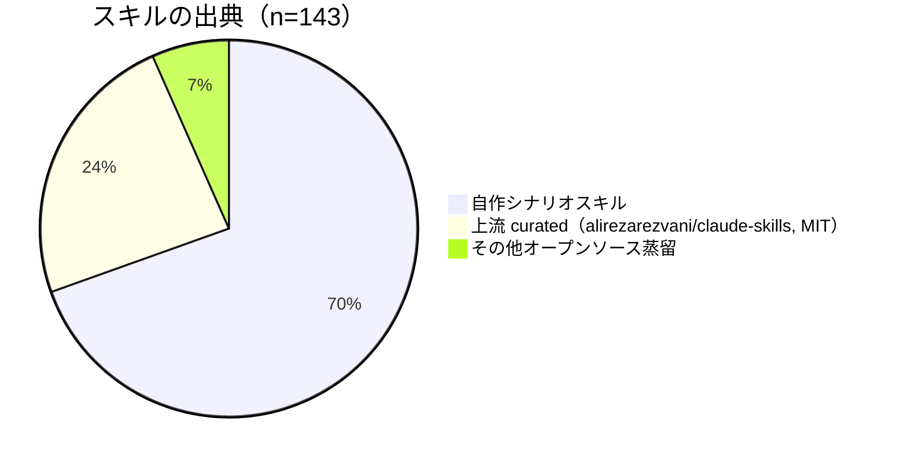

<p align="center"></p>

# awesome-skillkit

[](LICENSE)


[English](README.md) | [中文](README.zh-CN.md) | **日本語**

> 🌐 **閲覧 / ダウンロード**: サイトのソースリポジトリ（GitCode で Pages を有効化すると公開サイトになります。v0.18.0 まで同期済み）:
> [gitcode.com/badhope/skillkit-site](https://gitcode.com/badhope/skillkit-site)
> パックごとの zip と全量 `_all.zip` は各プラットフォームの Releases にあります（下記「プラットフォーム同期状況」参照）。
> デプロイ手順: [docs/DEPLOY-SITE.md](docs/DEPLOY-SITE.md)

AI ツール向けに精選した**シナリオスキルパック**集。**1 つのパック = 1 つの実世界シナリオ、その中に連携する複数の skill が入っています。** zip をダウンロード → 解凍 → skill フォルダを AI ツールの skills ディレクトリにドラッグ → すぐ使える。

## ポジショニング

**シナリオこそが答え——プラットフォームとツールに着地する、抽象分野ではなく。**


- 各パックは**具体的なシナリオ**（「PR をレビュー」「CI/CD を構築」「ブログに投稿」）に対応し、「エンジニアリング」「マーケティング」のような曖昧な言葉ではありません。
- 各パックは**そのシナリオで連携する skill の組み合わせ**をまとめています——絞り込んだ 1 ペアから、18 スキルのスイート `Content Publishing Automation`（中国系 16 プラットフォームをエンドツーエンドでカバー）まで。
- 各 skill の**出典は明記**されます（上流 curated / 自作 / オープンソース蒸留）。

## 数字で見る

> **143 skills** · **36 シナリオパック** · **18 チェーンドメイン / 58 スキルチェーン** · v0.18.0 · Apache-2.0

**出典の内訳**:



**パック規模の分布**（█ = 1 skill、全 36 パック）:

| 场景包 | 技能数 | 规模 |
|--------|:---:|------|
| AI Research & Writing | 19 | ███████████████████ |
| Content Publishing Automation | 18 | ██████████████████ |
| Office Productivity | 8 | ████████ |
| Data, ML & Scientific Computing | 7 | ███████ |
| AI Video Pipeline | 6 | ██████ |
| AI Agent Development | 5 | █████ |
| Code Review | 5 | █████ |
| AI Media Toolkit | 4 | ████ |
| Image Studio | 4 | ████ |
| Memory Systems | 4 | ████ |
| Toolsmith | 4 | ████ |
| Video Design Studio | 4 | ████ |
| Visual Design Studio | 4 | ████ |
| Workspace Integrations | 4 | ████ |
| System Architecture | 3 | ███ |
| Audio Studio | 3 | ███ |
| CI/CD Pipeline | 3 | ███ |
| Code Planning & Generation | 3 | ███ |
| Containers & Orchestration | 3 | ███ |
| De-AI Writing | 3 | ███ |
| Edu Craft | 3 | ███ |
| GitHub Collaboration | 3 | ███ |
| Growth Marketing | 3 | ███ |
| Homework Autopilot | 3 | ███ |
| Incident Response & SRE | 3 | ███ |
| Infrastructure as Code | 3 | ███ |
| Skill Forge | 3 | ███ |
| API Development & Testing | 2 | ██ |
| Database Design & Management | 2 | ██ |
| Data Viz Studio | 2 | ██ |
| Knowledge Base | 2 | ██ |
| Security & Secrets | 2 | ██ |
| Test-Driven Development | 2 | ██ |
| Viral Entertainment | 2 | ██ |
| Chat Prompt Craft | 1 | █ |
| Performance Profiling | 1 | █ |

## 30 秒で始める

1. 📦 必要な**シナリオ**の zip を **Releases** からダウンロード（または手元で `python3 build.py` を実行して `dist/*.zip` を生成）。
2. 📂 解凍——**複数の skill フォルダ**（各 `SKILL.md` を含む）が得られます。
3. 🧲 フォルダを AI ツールの skills ディレクトリに**ドラッグ**:
   - Claude Code: `~/.claude/skills/`（グローバル）または `.claude/skills/`（プロジェクト内）
   - skills に対応するその他のツール: 該当の skills ディレクトリを使用
4. 🚀 新しいセッションを開始——設定不要ですぐ動作。

## シナリオパック一覧


### エンジニアリングとプログラミング

| シナリオパック | スキル数 | シナリオ | 出典 |
|--------|:---:|------|:---:|
| AI Agent Development | 5 | 本番級エージェント、マルチエージェント、MCP、フィーチャーフラグ、自己評価 | 上游 |
| Code Review | 5 | PR レビュー、コード品質、依存関係監査、技術的負債 | 上游 |
| System Architecture | 3 | システムアーキテクチャ、ゼロダウンタイム移行、monorepo | 上游 |
| CI/CD Pipeline | 3 | CI/CD パイプライン、リリースゲート、spec 駆動開発 | 上游 |
| Code Planning & Generation | 3 | 曖昧な要件→構造化計画→生成→失敗診断 | 自研 |
| Containers & Orchestration | 3 | Dockerfile、compose、Helm、K8s operator | 上游 |
| GitHub Collaboration | 3 | 並列 worktree、Conventional changelog、PR レビュー | 上游 |
| Incident Response & SRE | 3 | インシデント指揮、runbook、SLO/エラーバジェット | 上游 |
| Infrastructure as Code | 3 | Terraform パターン、オブザーバビリティ、K8s | 上游 |
| API Development & Testing | 2 | REST API 設計レビュー、契約/統合テスト | 上游 |
| Database Design & Management | 2 | スキーマ設計、ERD、移行、SQL 最適化 | 上游 |
| Security & Secrets | 2 | シークレット保管、環境変数の衛生管理 | 上游 |
| Test-Driven Development | 2 | 単体テスト、fixture、mock、Red-Green リファクタ、Playwright フローテスト | 上游 |
| Chat Prompt Craft | 1 | 対話 AI プロンプト設計：5 要素の式、agent システムプロンプト、逆制約 | 自研 |
| Performance Profiling | 1 | Node/Python/Go の CPU/メモリ/IO プロファイリング | 上游 |

### リサーチとライティング

| シナリオパック | スキル数 | シナリオ | 出典 |
|--------|:---:|------|:---:|
| AI Research & Writing | 19 | 問いから完成稿へ：多轮リサーチ、テーマ選定、アウトライン、草稿、推敲、SEO、図表、LaTeX | 自研 |
| De-AI Writing | 3 | AI 痕跡の監査、人間らしい書き換え、個人の声紋プロファイル（AI 感低減） | 自研 |

### コンテンツ配信

| シナリオパック | スキル数 | シナリオ | 出典 |
|--------|:---:|------|:---:|
| Content Publishing Automation | 18 | 16+ 中国系プラットフォームの記事/動画配信、編集、クロスポスト、AI カバー | 自研 |

### ビデオ制作

| シナリオパック | スキル数 | シナリオ | 出典 |
|--------|:---:|------|:---:|
| AI Video Pipeline | 6 | ショート動画フルチェーン：脚本→ナレーション→リップシンク→編集→字幕→サムネイル→配信 | 自研 |
| AI Media Toolkit | 4 | テキスト/画像から動画・画像生成・楽曲生成・カバー（ローカル生成ゲートウェイ） | 自研 |
| Video Design Studio | 4 | 動画の前工程：絵コンテ、ショットレシピ、prompt 設計、スタイルアンカー | 自研 |
| Viral Entertainment | 2 | しゃべる赤ちゃんポッドキャスト、龍のキャラ meme ショート（キャラ一貫性） | 自研 |

### 画像とデザイン

| シナリオパック | スキル数 | シナリオ | 出典 |
|--------|:---:|------|:---:|
| Image Studio | 4 | 画像制作ワークベンチ：prompt、再描画、拡張、超解像 | 自研 |
| Visual Design Studio | 4 | brief→spec→prompt→layout 監査、デザインディレクターの 2 パス手法 | 自研 |

### オーディオ

| シナリオパック | スキル数 | シナリオ | 出典 |
|--------|:---:|------|:---:|
| Audio Studio | 3 | ポッドキャストチェーン：脚本→ナレーション→配信（Kokoro/Qwen3-TTS） | 自研 |

### データサイエンス

| シナリオパック | スキル数 | シナリオ | 出典 |
|--------|:---:|------|:---:|
| Data, ML & Scientific Computing | 7 | ETL、特徴エンジニアリング、モデリング求解、シミュレーション、可視化、ML パイプライン | 自研 |

### オフィス効率化

| シナリオパック | スキル数 | シナリオ | 出典 |
|--------|:---:|------|:---:|
| Office Productivity | 8 | PPT、Excel、Word、PDF、履歴書、議事録、社内報 | 自研 |

### グロースマーケティング

| シナリオパック | スキル数 | シナリオ | 出典 |
|--------|:---:|------|:---:|
| Growth Marketing | 3 | 電子商取引マーケティングチェーン：コピーフレーム、キャンペーン企画、チャネル適合 | 自研 |

### 教育

| シナリオパック | スキル数 | シナリオ | 出典 |
|--------|:---:|------|:---:|
| Edu Craft | 3 | マスター向け指導チェーン：講座→演習→フェインマン解説 | 自研 |
| Homework Autopilot | 3 | ワンクリック宿題完了（温かみあり版、冷たさ低減） | 自研 |

### メモリシステム

| シナリオパック | スキル数 | シナリオ | 出典 |
|--------|:---:|------|:---:|
| Memory Systems | 4 | 長期記憶：設計/抽出/管理/検索（mem0/letta から蒸留） | 自研 |

### ツールと自動化

| シナリオパック | スキル数 | シナリオ | 出典 |
|--------|:---:|------|:---:|
| Toolsmith | 4 | ファイル整理、一括リネーム、形式変換、定期タスク（すべて dry-run 優先） | 自研 |

### メタスキル

| シナリオパック | スキル数 | シナリオ | 出典 |
|--------|:---:|------|:---:|
| Skill Forge | 3 | スキル生成、仕様チェック（CI ゲート）、スキル検索と組み立て | 自研 |

### 外部連携

| シナリオパック | スキル数 | シナリオ | 出典 |
|--------|:---:|------|:---:|
| Workspace Integrations | 4 | Notion / 飛書・釘釘・WeCom / Jira・Linear・GitHub Issues / クラウドストレージ | 自研 |

### 個人ナレッジベース

| シナリオパック | スキル数 | シナリオ | 出典 |
|--------|:---:|------|:---:|
| Knowledge Base | 2 | ノート庫の構築（索引・検索・点検）、ナレッジグラフの抽出と出力 | 自研 |

### データ可視化

| シナリオパック | スキル数 | シナリオ | 出典 |
|--------|:---:|------|:---:|
| Data Viz Studio | 2 | CSV 分析 → ダッシュボード生成（外部依存ゼロ）、グラフ選択辞書 | 自研 |

## ディテール辞書（本リポジトリの差別化ポイント）

生成系 skill の成否は「記述がどれだけ細かいか」にかかっています。高頻度シナリオ向けに**高密度のディテール辞書**を整備しました——用語 + 効果・感情 + 使いどき + 例。prompt を書く前にまず引いてください:

| 辞書 | 領域 | カバー内容 |
|------|:---:|-----------|
| `cinematography-lexicon.md` | ビデオ | 17 種のトランジション / 動詞の空間的意味 / 微表情演技 / 速度・リズム / 5 モデル方言 / 反復修正対照 ||| `visual-detail-lexicon.md` | 画像 | 3 層のライティング 30+ 項目 / 構図 / 焦点距離と遠近性格 / マテリアル積み重ね式 / 静止画の動勢語 ||| `music-style-lexicon.md` | 音楽 | 5 スロット Style 式 / ジャンル系統樹 / 感情×BPM 相性禁止 / 構造・ボーカル・楽器 tag 全集 / ネガティブリスト ||| `emotion-delivery-lexicon.md` | 音声 | 感情→表現手法 / 句読点の停止階層 / アクセント位置 / 二人対話のリズム ||| `copywriting-formulas.md` | コピー | 10 型の見出し式 / PAS・FAB・AIDA 構造 / 場面別 CTA / 4 プラットフォームの調性差 ||| `layout-and-chart-rules.md` | PPT | フォントサイズ階層表 / 1 枚あたり情報密度の限界 / グラフ選択決定木 / WCAG コントラスト ||| `camera-vocabulary.md` | ビデオ | カメラワーク・ショットサイズ / 基本トランジション（入門層） ||| `rest_design_rules.md` | API | REST 設計レビュー規則セット ||| `bounded_autonomy_rules.md` | CI/CD | 境界自律規則（人間承認ノード） ||| `platform-rules.md` | SEO | 各プラットフォーム配信規則とセンシティブ語 |

> 例: ビデオの `cinematography-lexicon.md` は「トランジション」を 17 種（smash cut / match cut / J-cut / invisible cut…）に分解し、「動詞の空間的意味表」も付属——`approaches` と `comes` のレベル差まで書かれており、AI に「どんなショットが欲しいか」を正確に伝えられます。

## 代表スキルチェーン（単点ではなくパイプライン）

```mermaid
flowchart LR
    subgraph ショート動画パイプライン
    S[video-script-writer] --> V[video-voice-synth]
    V --> L[video-lip-sync] --> E[video-editor]
    E --> SUB[video-subtitles] --> T[video-thumbnail] --> P[配信]
    end
    subgraph リサーチ・ライティングチェーン
    R[deep-research] --> O[article-outliner] --> D[article-drafter]
    D --> C[content-editor] --> Q[seo-optimizer]
    end
    subgraph 配信チェーン
    W[記事/動画] --> A[ai-cover-generator] --> X[cross-post-orchestrator]
    X --> Z[16+ プラットフォーム]
    end
```

`skill_chains.json` には **18 チェーンドメイン / 58 チェーン** が組み込まれ、「誰を先に呼ぶか、誰に渡すか」を固定し、モジュール間のクロスコールでも迷いません。

## プラットフォーム同期状況

| プラットフォーム | リポジトリ | コード同期 | Release / 添付 | 状態 |
|----------------|-----------|:---:|:---:|------|
| GitCode | `badhope/awesome-skillkit` | ✅ `0.18.0` まで | ✅ 作成済 | OK |
| Gitee | `badhope/awesome-skillkit` | ✅ `0.18.0` まで | ✅ v0.18.0、zip 添付 32 個 | OK |
| GitHub | `x33834/awesome-skillkit` | ⚠️ ローカルからプッシュ | ⚠️ なし | サンドボックスの出口 ACL が TLS を遮断。ローカルで `git push origin main --follow-tags`（token は repo+workflow 権限必要）を実行 |
| サイト | `badhope/skillkit-site` | ✅ v0.18.0 同期済 | — | GitCode Pages を有効化で公開 |

> GitHub は構築環境の出口 ACL が TLS ハンドシェイク層で遮断するため、本環境から直接プッシュできません。コードと Release の内容は GitCode / Gitee で完全にホスト済みです。ローカルで 1 コマンド実行すれば GitHub も補完できます。

## ディレクトリ構成

```
packs/              # シナリオパック定義（シナリオごとに 1 ディレクトリ。pack.json = メタデータ + スキル一覧 + 出典）
skills/             # 全 skill の単一ソース（多階層分類）
  ├─ programming/   # 上流 curated（alirezarezvani、33 のプログラミングスキル）
  ├─ writing/       # 自作シナリオスキル
  ├─ video/ design/ audio/ marketing/ education/ scenarios/ …
  └─ skill_chains.json  # 13 ドメイン / 48 チェーン
dist/               # ビルド成果物：パックごと 1 zip（gitignored）
```

## 出典と署名

2 つのトラックを採用し、すべて [manifest.json](manifest.json)、各 `packs/*/pack.json`、[SOURCES.md](SOURCES.md) で skill ごとに署名:

- **自作シナリオスキル（105 個）**: `skills/writing/`、`scenarios/`、`design/`、`audio/` など。中国系プラットフォーム自動化、動画/画像/音声パイプライン、AI 感低減ライティング、メモリシステム、宿題オートパイロットなど——いずれも上流がカバーしていないオリジナルワークフローで、実行可能な lint スクリプトと単体テストを備え、デフォルトで dry-run。
- **上流 curated（36 個、MIT）**: [alirezarezvani/claude-skills](https://github.com/alirezarezvani/claude-skills) 由来のプログラミング・エンジニアリング系スキル。
- **その他オープンソース蒸留（10 個）**: Anthropic 公開 skills ドキュメント、mem0/letta/Claude memory tool、Kokoro/Qwen3-TTS エコシステムから方法論を蒸留。いずれも `references/sources-and-methodology.md` で署名、**内容のコピーはゼロ**。

## ビルドとリリース

```bash
python3 build.py                           # 単一ビルド入口: パックごと dist/*.zip + dist/_all.zip
python3 tools/release.py 0.18.0 --commit   # CHANGELOG 検証 → 昇格 → コミット → タグ
git push origin main --follow-tags            # コード + 3 バージョンタグをプッシュ
# Gitee / GitCode で Release を作成し dist/*.zip をアップロード（manifest.json の version が単一の真実）
```

## License

[Apache License 2.0](LICENSE) © 2026 Morningstar202604
