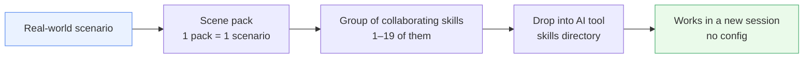

<p align="center"></p>

<h1 align="center">awesome-skillkit</h1>

<p align="center">
  <b>37 の実務シーンパック · 156 の厳選スキル · 解凍してドロップイン——<br>AI ツールが即座に仕事を覚えます。</b>
</p>

<p align="center">
  <a href="LICENSE"></a>
  
  
  
</p>

<p align="center">
  <a href="https://x33834.github.io/awesome-skillkit/"></a>
  <a href="https://github.com/x33834/awesome-skillkit/releases/latest/download/_all.zip"></a>
  <a href="https://gitcode.com/badhope/awesome-skillkit"></a>
  <a href="https://gitee.com/badhope/awesome-skillkit"></a>
</p>

<p align="center"><a href="README.md">English</a> | <a href="README.zh-CN.md">简体中文</a> | <strong>日本語</strong></p>

---

## 🌐 このページを他の言語で読む（ワンクリック）

リポジトリ内の SKILL.md ファイルは英語へ翻訳中ですが、ドキュメント・事例・プラットフォーム注記の多くはまだ中国語で書かれています。この README と公式サイトを他の言語で即座に読むには:

- **[🌐 Google 翻訳 — 公式サイトを中文（簡体字）で読む](https://translate.google.com/translate?sl=ja&tl=zh-CN&u=https://x33834.github.io/awesome-skillkit/)**（推奨 — ワンクリック、インストール不要）
- **[🌐 Google 翻訳 — 公式サイトを English で読む](https://translate.google.com/translate?sl=ja&tl=en&u=https://x33834.github.io/awesome-skillkit/)**（推奨 — ワンクリック）
- **[Bing Translator で翻訳](https://cn.bing.com/translator?from=ja&to=zh-Hans)**（任意のページ URL を貼り付けて翻訳）
- **[Immersive Translate ブラウザ拡張](https://github.com/immersive-translate/immersive-translate)**（日常使いに推奨 — サイト全体のバイリンガル横並び表示）
- 📄 他言語 README: [**English (README.md)**](README.md) ・ [**中文简体 (README.zh-CN.md)**](README.zh-CN.md)

---

## これは何？

**awesome-skillkit** は、AI コーディング / エージェントツール（Claude Code や `SKILL.md` を読み込めるあらゆるツール）向けに精選した**シナリオパック集**です。各パックは、**1 つの具体的な実世界シナリオ**のために連携するスキルをまとめてバンドルしています——「PR をレビューする」「CI/CD パイプラインをリリースする」「記事を 16 の中国語プラットフォームにクロスポストする」「ショート動画をエンドツーエンドで制作する」といった単位です。

設計思想は徹底してシンプルです。



- 各パックは**具体的なシナリオ**に対応しており、「エンジニアリング」のような曖昧なドメインではありません。
- 各パックは、そのシナリオで**実際に連携するスキルだけ**をまとめています——絞り込んだ 2 スキル構成（`API Development & Testing`）から、18 スキルのスイート（`AI Research & Writing`）、18 プラットフォームの自動出版マシン（`Content Publishing Automation`）まで。
- 各スキルの**出典はスキルごとに** [`manifest.json`](manifest.json) と各 `packs/*/pack.json` に明記されています——自作、上流からの精選（MIT）、公開ドキュメントからの蒸留のいずれかです。

## ダウンロードガイド — 2 つの経路

### パス A · 公式サイトを見る（一番簡単）

1. **<https://x33834.github.io/awesome-skillkit/>** を開きます。
2. スキル名、ドメインチップ、パック名で検索します。
3. 任意のスキルカードで **↓ SKILL.md** をクリックすると単一ファイルをダウンロードできます。パックカードからパック全体を zip でダウンロードすることもできます。
4. 全部まとめて取得するには、ヒーローセクションの **↓ `_all.zip`** をクリックします。

### パス B · リポジトリを直接見る

| 欲しいもの | 入手先 |
|---|---|
| 単一の `SKILL.md` | [`skills/`](skills/) をブラウズしてファイルをそのまま開く |
| 1 パックを zip で | [`dist/<pack-id>.zip`](dist/)（ローカルビルド）または [Releases](https://github.com/x33834/awesome-skillkit/releases/latest) のパック別アセット |
| 全パックをまとめて | `dist/_all.zip`、または [`_all.zip` リリースアセット](https://github.com/x33834/awesome-skillkit/releases/latest/download/_all.zip) |
| 中国語ミラー | [GitCode](https://gitcode.com/badhope/awesome-skillkit) · [Gitee](https://gitee.com/badhope/awesome-skillkit)（同一タグ、リリース zip 添付） |

> パック別 zip は `python3 build.py` で再ビルドされ、すべての GitHub Release に添付されます。GitCode / Gitee ミラーは同一タグをプッシュし、同一アセットをアップロードしています。

## シナリオパック一覧（全 39 パック）

以下が完全なカタログです。各行はパックフォルダへのリンクになっており、スキル列には同梱されるすべての `SKILL.md` を列挙しています。

| Pack ID | パック名 (英語) | パック名 (日本語) | スキル数 | 同梱スキル |
|---|---|---|:---:|---|
| [`ai-agent-development`](packs/ai-agent-development) | AI Agent Development | AI Agent開発 | 5 | `agent-designer`, `mcp-server-builder`, `feature-flags-architect`, `self-eval`, `skill-tester` |
| [`ai-media-toolkit`](packs/ai-media-toolkit) | AI Media Toolkit | AIメディア生成ツールボックス | 3 | `video-generation`, `image-generation`, `music-generation` |
| [`ai-research-writing`](packs/ai-research-writing) | AI Research & Writing | AIリサーチ＆ライティング | 18 | `deep-research`, `web-search`, `paper-topic-selector`, `article-outliner`, `article-drafter`, `content-editor`, `seo-optimizer`, `lit-review`, `experiment-runner`, `arch-diagram`, `neural-net-draw`, `latex-formatter`, `self-reviewer`, `journal-adapt`, `anti-defensive`, `ai-humanizer`, `tex-cleaner`, `pub-plotter` |
| [`ai-video-pipeline`](packs/ai-video-pipeline) | AI Video Pipeline | AIショート動画制作パイプライン | 9 | `video-script-writer`, `video-voice-synth`, `video-lip-sync`, `video-editor`, `video-subtitles`, `video-thumbnail`, `transition-designer`, `motion-effects-designer`, `sound-designer` |
| [`api-development`](packs/api-development) | API Development & Testing | API開発とテスト | 2 | `api-design-reviewer`, `api-test-suite-builder` |
| [`architecture`](packs/architecture) | System Architecture | システムアーキテクチャ設計 | 3 | `senior-architect`, `migration-architect`, `monorepo-navigator` |
| [`audio-studio`](packs/audio-studio) | Audio Studio | オーディオスタジオ | 4 | `podcast-producer`, `tts-voice-director`, `episode-publisher`, `sound-designer` |
| [`chat-prompt-craft`](packs/chat-prompt-craft) | Chat Prompt Craft | チャットプロンプト術 | 1 | `chat-prompt-engineer` |
| [`ci-cd`](packs/ci-cd) | CI/CD Pipeline | CI/CDパイプライン | 3 | `ci-cd-pipeline-builder`, `ship-gate`, `spec-driven-workflow` |
| [`code-planning`](packs/code-planning) | Code Planning & Generation | コード計画と生成 | 3 | `code-intent-planner`, `code-generator`, `debug-diagnoser` |
| [`code-review`](packs/code-review) | Code Review | コードレビュー | 4 | `code-reviewer`, `api-design-reviewer`, `tech-debt-tracker`, `dependency-auditor` |
| [`communication-essentials`](packs/communication-essentials) | Communication Essentials | コミュニケーション必携 | 2 | `tactful-communication`, `decision-debiasing` |
| [`containers`](packs/containers) | Containers & Orchestration | コンテナとオーケストレーション | 3 | `docker-development`, `helm-chart-builder`, `kubernetes-operator` |
| [`content-publishing`](packs/content-publishing) | Content Publishing Automation | コンテンツ多プラットフォーム自動公開 | 18 | `zhihu-content-manager`, `cnblogs-skill`, `wechat-mp-publisher`, `juejin-publisher`, `csdn-publisher`, `jianshu-publisher`, `bilibili-publisher`, `toutiao-publisher`, `baijiahao-publisher`, `xiaohongshu-publisher`, `weibo-publisher`, `douban-publisher`, `v2ex-publisher`, `segmentfault-publisher`, `oschina-publisher`, `static-blog-deploy`, `cross-post-orchestrator`, `image-generation` |
| [`data-ml-science`](packs/data-ml-science) | Data, ML & Scientific Computing | データ・機械学習・科学計算 | 7 | `etl-builder`, `feature-engineer`, `model-formulator`, `model-solver`, `simulation-runner`, `result-visualizer`, `ml-pipeline` |
| [`database`](packs/database) | Database Design & Management | データベース設計と管理 | 2 | `database-designer`, `sql-database-assistant` |
| [`dataviz-studio`](packs/dataviz-studio) | Data Viz Studio | データ可視化スタジオ | 2 | `dashboard-designer`, `chart-recommender` |
| [`de-ai-writing`](packs/de-ai-writing) | De-AI Writing | AIっぽさ除去ライティング | 3 | `ai-trace-auditor`, `humanize-rewriter`, `personal-voice-profile` |
| [`edu-craft`](packs/edu-craft) | Edu Craft | 教育クラフト | 3 | `course-designer`, `exercise-generator`, `feynman-explainer` |
| [`github-workflow`](packs/github-workflow) | GitHub Collaboration | GitHubコラボレーション | 3 | `git-worktree-manager`, `changelog-generator`, `code-reviewer` |
| [`growth-marketing`](packs/growth-marketing) | Growth Marketing | グロースマーケティング | 3 | `product-copywriter`, `campaign-designer`, `channel-adapter` |
| [`homework-autopilot`](packs/homework-autopilot) | Homework Autopilot | 宿題オートパイロット | 3 | `assignment-intake`, `solution-drafter`, `own-voice-rewrite` |
| [`image-studio`](packs/image-studio) | Image Studio | 画像生成ワークベンチ | 4 | `image-prompt-engineer`, `image-generation`, `visual-style-anchor`, `image-batch-processor` |
| [`incident-response`](packs/incident-response) | Incident Response & SRE | 障害対応とSRE | 3 | `incident-commander`, `runbook-generator`, `slo-architect` |
| [`infrastructure`](packs/infrastructure) | Infrastructure as Code | インフラ as Code | 3 | `terraform-patterns`, `observability-designer`, `kubernetes-operator` |
| [`knowledge-base`](packs/knowledge-base) | Knowledge Base | パーソナル知識ベース | 2 | `personal-wiki`, `knowledge-graph-builder` |
| [`life-essentials`](packs/life-essentials) | Life Essentials | 生活必携 | 4 | `home-renovation-avoidance`, `medical-visit-guide`, `car-purchase-maintenance`, `rental-contract-guide` |
| [`memory-systems`](packs/memory-systems) | Memory Systems | 長期記憶システム | 4 | `memory-architect`, `memory-extractor`, `memory-manager`, `memory-retriever` |
| [`office-productivity`](packs/office-productivity) | Office Productivity | 業務効率ツールボックス | 10 | `ppt-builder`, `excel-assistant`, `resume-tailor`, `meeting-notes`, `internal-comms-writer`, `docx-writer`, `pdf-pipeline`, `epub-builder`, `docx-template-fill`, `career-ops-lite` |
| [`performance`](packs/performance) | Performance Profiling | パフォーマンス最適化 | 1 | `performance-profiler` |
| [`security`](packs/security) | Security & Secrets | セキュリティとシークレット管理 | 4 | `secrets-vault-manager`, `env-secrets-manager`, `pii-redactor`, `prompt-injection-guard` |
| [`skill-forge`](packs/skill-forge) | Skill Forge | スキル鍛造所 | 5 | `skill-author`, `skill-linter`, `skill-finder`, `session-handoff`, `weekly-report-generator` |
| [`tdd`](packs/tdd) | Test-Driven Development | テスト駆動開発 | 4 | `tdd-guide`, `webapp-flow-tester`, `webapp-e2e-harness`, `agent-eval-harness` |
| [`toolsmith`](packs/toolsmith) | Toolsmith | ツールと自動化 | 6 | `file-organizer`, `batch-renamer`, `format-converter`, `task-scheduler`, `invoice-organizer`, `bank-statement-reconcile` |
| [`video-design-studio`](packs/video-design-studio) | Video Design Studio | 動画デザインスタジオ | 5 | `storyboard-designer`, `shot-designer`, `visual-style-anchor`, `transition-designer`, `motion-effects-designer` |
| [`viral-entertainment`](packs/viral-entertainment) | Viral Entertainment | バズるエンタメシナリオ | 2 | `ai-baby-podcast`, `nailong-laugh-shorts` |
| [`visual-design-studio`](packs/visual-design-studio) | Visual Design Studio | ビジュアルデザインスタジオ | 7 | `design-brief-interpreter`, `image-prompt-engineer`, `layout-spec-auditor`, `frontend-design-director`, `frontend-component-lab`, `ui-ux-accessibility`, `design-system-foundations` |
| [`web-ops`](packs/web-ops) | Web Operations | ウェブ操作 | 1 | `web-data-extractor` |
| [`workspace-integrations`](packs/workspace-integrations) | Workspace Integrations | 外部連携ツールボックス | 4 | `notion-workspace`, `feishu-dingtalk-bridge`, `issue-tracker-sync`, `cloud-drive-manager` |

> 一部のスキル（例: `api-design-reviewer`、`kubernetes-operator`、`image-generation`）は複数のパックに登場しますが、シナリオをまたいで再利用されるためです——意図的な設計です。

## インストール方法（30 秒）

1. 必要なシナリオの zip を**ダウンロード**します（または `_all.zip` を取得）。
2. **解凍**すると、スキルごとに 1 フォルダ（各 `SKILL.md` を含む）が得られます。
3. スキルフォルダを AI ツールの skills ディレクトリに**ドラッグ**します:
   - Claude Code: `~/.claude/skills/`（グローバル）または `.claude/skills/`（プロジェクト別）
   - その他の skills 対応ツール: 各ツールのドキュメントに記載された skills ディレクトリを使用します。
4. **新しいセッションを開始**します。環境変数も設定も不要——ユーザーのリクエストがスキルの説明に一致すると、自動的に起動します。

## AI と一緒に使う — まずスキルを確認

AI エージェントが本リポジトリで作業するときは、[AGENTS.md](AGENTS.md) のグローバルルールに従います：**各タスクの開始時、および新しい段階に入ったとき・サブ問題に出会ったとき、まず本リポジトリに該当するスキルがあるか確認し、あればそれを使うこと。**

1. 説明を確認：`skills/**/SKILL.md` の frontmatter `description`（トリガー語 / "Use when" / "Do NOT"）が照合基準です。
2. キーワード検索：`python3 skills/meta/skill-finder/scripts/find_skill.py search <キーワード>`。
3. 複数ステップのタスクは [`skills/skill_chains.json`](skills/skill_chains.json) の `domains[].entry`（オーケストレーター）から入って chain の step をたどります。

該当がなければ通常どおり進みます。無理にスキルを当てはめないこと。

## ソースからビルドする

```bash
python3 build.py     # regenerates dist/<pack-id>.zip for every pack + dist/_all.zip
```

`build.py` は [`manifest.json`](manifest.json) と `packs/*/pack.json` を読み込み、`skills/` から参照されたスキルフォルダをステージングして zip を書き出します。`dist/` ディレクトリは gitignore されており、CI / Releases がビルド成果物を添付します。

## コントリビュート

[CONTRIBUTING.md](CONTRIBUTING.md) を参照してください。要点: 新しいパックはまず issue を立ててください。新規スキルには `SKILL.md`、`packs/*/pack.json` への出典明記、[`tests/`](tests/) 配下のスモークテストが必須です。

## ライセンス

[Apache License 2.0](LICENSE) © 2026 Morningstar202604
