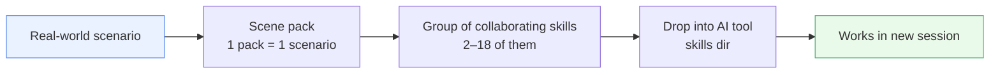
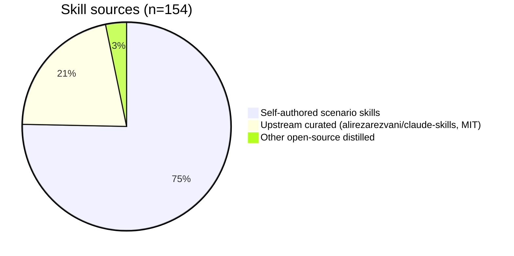
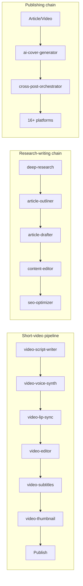

<p align="center"></p>

<h1 align="center">awesome-skillkit</h1>

<p align="center">
  <b>36 real-world scene packs · 154 curated skills · unzip &amp; drop-in —<br>your AI tool instantly knows the job.</b>
</p>

<p align="center">
  <a href="LICENSE"></a>
  
  
  
  
</p>

<p align="center">
  <a href="https://x33834.github.io/awesome-skillkit/"></a>
  <a href="https://github.com/x33834/awesome-skillkit/releases/latest/download/_all.zip"></a>
  <a href="https://gitcode.com/badhope/awesome-skillkit"></a>
  <a href="https://gitee.com/badhope/awesome-skillkit"></a>
  <a href="https://github.com/Morningstar202604/awesome-skillkit"></a>
</p>

<p align="center"><strong>English</strong> | <a href="README.zh-CN.md">中文</a> | <a href="README.ja.md">日本語</a></p>

> 🌐 **Browse / download**: the official sites are live on GitHub Pages (both accounts, identical) →
> [x33834.github.io/awesome-skillkit](https://x33834.github.io/awesome-skillkit/) ·
> [morningstar202604.github.io/awesome-skillkit](https://morningstar202604.github.io/awesome-skillkit/).
> Per-pack zips and the full `_all.zip` are attached to each platform's Release
> (GitHub / Gitee serve direct links; GitCode links to its Release page).
> Self-hosting guide: [docs/DEPLOY-SITE.md](docs/DEPLOY-SITE.md)

Curated **scene packs** for AI tools. **Each pack = one real-world scenario, containing multiple hand-picked skills.** Download a zip → unzip → drag the skill folders into your AI tool's skills directory → it just works.

## Positioning

**The scenario is the answer — grounded in platform + tool.**



- Every pack maps to a **concrete scenario** ("review a PR", "build CI/CD", "post to my blog"), not a broad domain.
- Every pack bundles **the skills that work together for that scenario** — from a focused pair to an 18-skill suite (`Content Publishing Automation` covers 16 Chinese platforms end-to-end).
- Every skill's **source is clearly attributed** (upstream curated / self-authored / open-source distilled).

## By the numbers

> **154 skills** · **36 scene packs** · **18 chain domains / 62 skill chains** · v0.22.0 · Apache-2.0

**Source breakdown**:



**Pack size distribution** (█ = 1 skill, 36 packs total):

| 场景包 | 技能数 | 规模 |
|--------|:---:|------|
| AI Research & Writing | 19 | ███████████████████ |
| Content Publishing Automation | 18 | ██████████████████ |
| Office Productivity | 8 | ████████ |
| Data, ML & Scientific Computing | 7 | ███████ |
| AI Video Pipeline | 6 | ██████ |
| AI Agent Development | 5 | █████ |
| Code Review | 5 | █████ |
| AI Media Toolkit | 4 | ████ |
| Image Studio | 4 | ████ |
| Memory Systems | 4 | ████ |
| Toolsmith | 4 | ████ |
| Video Design Studio | 4 | ████ |
| Visual Design Studio | 4 | ████ |
| Workspace Integrations | 4 | ████ |
| System Architecture | 3 | ███ |
| Audio Studio | 3 | ███ |
| CI/CD Pipeline | 3 | ███ |
| Code Planning & Generation | 3 | ███ |
| Containers & Orchestration | 3 | ███ |
| De-AI Writing | 3 | ███ |
| Edu Craft | 3 | ███ |
| GitHub Collaboration | 3 | ███ |
| Growth Marketing | 3 | ███ |
| Homework Autopilot | 3 | ███ |
| Incident Response & SRE | 3 | ███ |
| Infrastructure as Code | 3 | ███ |
| Skill Forge | 3 | ███ |
| API Development & Testing | 2 | ██ |
| Database Design & Management | 2 | ██ |
| Data Viz Studio | 2 | ██ |
| Knowledge Base | 2 | ██ |
| Security & Secrets | 2 | ██ |
| Test-Driven Development | 2 | ██ |
| Viral Entertainment | 2 | ██ |
| Chat Prompt Craft | 1 | █ |
| Performance Profiling | 1 | █ |

## Getting started (30 seconds)

1. 📦 Download the zip for the **scene** you need from **Releases** (or run `python3 build.py` to build `dist/*.zip` locally).
2. 📂 Unzip — you get **multiple skill folders** (each with `SKILL.md`).
3. 🧲 **Drag** the folders into your AI tool's skills directory:
   - Claude Code: `~/.claude/skills/` (global) or `.claude/skills/` (project)
   - Other tools with skills support: use their skills directory
4. 🚀 Start a new session — works immediately, no config.

## Scene pack catalog


### 工程与编程

| Scene pack | Skills | Scenario | Source |
|--------|:---:|------|:---:|
| AI Agent Development | 5 | 生产级 Agent、多智能体、MCP、特性开关、自评估 | 上游 |
| Code Review | 5 | PR 审查、代码质量、依赖审计、技术债 | 上游 |
| System Architecture | 3 | 系统架构、零停机迁移、monorepo | 上游 |
| CI/CD Pipeline | 3 | CI/CD 流水线、发布门、spec 驱动开发 | 上游 |
| Code Planning & Generation | 3 | 模糊需求→结构化计划→生成→失败诊断 | 自研 |
| Containers & Orchestration | 3 | Dockerfile、compose、Helm、K8s operator | 上游 |
| GitHub Collaboration | 3 | 并行 worktree、约定式 changelog、PR 审查 | 上游 |
| Incident Response & SRE | 3 | 事故指挥、runbook、SLO/错误预算 | 上游 |
| Infrastructure as Code | 3 | Terraform 模式、可观测性、K8s | 上游 |
| API Development & Testing | 2 | REST API 设计审查、契约/集成测试 | 上游 |
| Database Design & Management | 2 | 库设计、ERD、迁移、SQL 优化 | 上游 |
| Security & Secrets | 2 | 密钥库、环境变量卫生 | 上游 |
| Test-Driven Development | 2 | 单测、fixture、mock、红绿重构、Playwright 流程测试 | 上游 |
| Chat Prompt Craft | 1 | 对话 AI 提示词工程：五要素公式、agent 系统提示、反向约束 | 自研 |
| Performance Profiling | 1 | Node/Python/Go 的 CPU/内存/IO 剖析 | 上游 |

### 研究与写作

| Scene pack | Skills | Scenario | Source |
|--------|:---:|------|:---:|
| AI Research & Writing | 19 | 从问题到成稿：多轮研究、选题、大纲、草稿、润色、SEO、图表、LaTeX | 自研 |
| De-AI Writing | 3 | AI 痕迹审计、人声改写、个人声纹档案（降低 AI 感） | 自研 |

### 内容发布

| Scene pack | Skills | Scenario | Source |
|--------|:---:|------|:---:|
| Content Publishing Automation | 18 | 16+ 中文平台文章/视频发布、编辑、跨平台分发、AI 封面 | 自研 |

### 视频创作

| Scene pack | Skills | Scenario | Source |
|--------|:---:|------|:---:|
| AI Video Pipeline | 6 | 短视频全链路：脚本→配音→对口型→剪辑→字幕→封面→发布 | 自研 |
| AI Media Toolkit | 4 | 文/图生视频、生图、生乐、封面（本地生成网关） | 自研 |
| Video Design Studio | 4 | 视频前期：分镜、镜头配方、prompt 工程、风格锚点 | 自研 |
| Viral Entertainment | 2 | 会说话宝宝播客、龙崽 meme 短片（角色一致性） | 自研 |

### 图像与设计

| Scene pack | Skills | Scenario | Source |
|--------|:---:|------|:---:|
| Image Studio | 4 | 图像创作工作台：prompt、重绘、扩图、超分 | 自研 |
| Visual Design Studio | 4 | brief→spec→prompt→layout 审计，设计总监两遍工作流 | 自研 |

### 音频

| Scene pack | Skills | Scenario | Source |
|--------|:---:|------|:---:|
| Audio Studio | 3 | 播客链：脚本→配音→发布（Kokoro/Qwen3-TTS） | 自研 |

### 数据科学

| Scene pack | Skills | Scenario | Source |
|--------|:---:|------|:---:|
| Data, ML & Scientific Computing | 7 | ETL、特征工程、建模求解、仿真、可视化、ML 流水线 | 自研 |

### 办公生产力

| Scene pack | Skills | Scenario | Source |
|--------|:---:|------|:---:|
| Office Productivity | 8 | PPT、Excel、Word、PDF、简历、纪要、内部通讯 | 自研 |

### 增长营销

| Scene pack | Skills | Scenario | Source |
|--------|:---:|------|:---:|
| Growth Marketing | 3 | 电商营销链：文案框架、活动策划、渠道适配 | 自研 |

### 教育

| Scene pack | Skills | Scenario | Source |
|--------|:---:|------|:---:|
| Edu Craft | 3 | 精通教学链：课程→练习→费曼讲解 | 自研 |
| Homework Autopilot | 3 | 一键作业完成（有温度版，降低冷血感） | 自研 |

### 记忆系统

| Scene pack | Skills | Scenario | Source |
|--------|:---:|------|:---:|
| Memory Systems | 4 | 长期记忆：设计/抽取/管理/检索（mem0/letta 蒸馏） | 自研 |

### 工具与自动化

| Scene pack | Skills | Scenario | Source |
|--------|:---:|------|:---:|
| Toolsmith | 4 | 文件整理、批量重命名、格式转换、定时任务（全部 dry-run 优先） | 自研 |

### 元技能

| Scene pack | Skills | Scenario | Source |
|--------|:---:|------|:---:|
| Skill Forge | 3 | 技能生成、规范校验（CI 门禁）、技能检索与装配 | 自研 |

### 外部集成

| Scene pack | Skills | Scenario | Source |
|--------|:---:|------|:---:|
| Workspace Integrations | 4 | Notion / 飞书·钉钉·企业微信 / Jira·Linear·GitHub Issues / 云盘归档 | 自研 |

### 个人知识库

| Scene pack | Skills | Scenario | Source |
|--------|:---:|------|:---:|
| Knowledge Base | 2 | 笔记库构建（索引/检索/体检）、知识图谱抽取与导出 | 自研 |

### 数据可视化

| Scene pack | Skills | Scenario | Source |
|--------|:---:|------|:---:|
| Data Viz Studio | 2 | CSV 剖析 → 仪表盘生成（零外部依赖）、图表选择词库 | 自研 |

## Detail lexicons (the differentiator)

Generation-quality skills live or die on *how detailed the prompt is*. We ship **high-density detail lexicons** — term + effect/mood + when-to-use + example — to consult before writing a prompt:

| Lexicon | Domain | Coverage |
|---------|:---:|---------|
| `cinematography-lexicon.md` | 视频 | 17 种转场 / 动作动词空间语义 / 微表情表演 / 速度节奏 / 五模型方言 / 迭代修复对照 ||| `visual-detail-lexicon.md` | 图像 | 三层光照 30+ 词条 / 构图 / 焦段透视性格 / 材质堆叠公式 / 静态图动势词 ||| `music-style-lexicon.md` | 音乐 | 五槽位 Style 公式 / 曲风族谱 / 情绪×BPM 禁配 / 结构·人声·乐器 tag 全集 / 负面清单 ||| `emotion-delivery-lexicon.md` | 语音 | 情绪→文案手法 / 标点停顿层级 / 重音位置 / 双人对话节奏 ||| `copywriting-formulas.md` | 文案 | 10 型标题公式 / PAS·FAB·AIDA 结构 / CTA 按场景 / 四平台调性差异 ||| `layout-and-chart-rules.md` | PPT | 字号层级表 / 每页信息密度红线 / 图表选择决策树 / WCAG 对比度 ||| `camera-vocabulary.md` | 视频 | 运镜景别 / 基础转场（入门层） ||| `rest_design_rules.md` | API | REST 设计审查规则集 ||| `bounded_autonomy_rules.md` | CI/CD | 边界自治规则（人类审批节点） ||| `platform-rules.md` | SEO | 各平台发布规则与敏感词 |

## Representative skill chains (pipelines, not single points)



`skill_chains.json` ships **18 chain domains / 58 chains**, pinning "who runs first, who hands off to whom" so cross-module calls never get lost.

## Platform sync status

Four platforms in parallel (same branches, tags, and HEAD) — no favorites:

| Platform | Repo | Code sync | Release / assets | Status |
|----------|------|:---:|:---:|--------|
| GitHub | `x33834/awesome-skillkit` | ✅ through `0.22.0` | ✅ v0.22.0 + 37 zip assets | OK |
| GitHub | `Morningstar202604/awesome-skillkit` | ✅ through `0.22.0` | ✅ site | OK |
| GitCode | `badhope/awesome-skillkit` | ✅ through `0.22.0` | ✅ v0.22.0 release | OK |
| Gitee | `badhope/awesome-skillkit` | ✅ through `0.22.0` | ✅ v0.22.0, 37 zip assets | OK |

Sites (GitHub Pages, both accounts): <https://x33834.github.io/awesome-skillkit/> · <https://morningstar202604.github.io/awesome-skillkit/>

> 2026-09-22: all four mirrors synced to **v0.22.0** (code + tags). v0.22.0 assets: GitHub 37 zips, Gitee 37 zips, GitCode auto source archives.

## Directory layout

```
packs/              # scene pack definitions (one dir per scenario; pack.json = metadata + skill list + sources)
skills/             # single source of truth for all skills (multi-level taxonomy)
  ├─ programming/   # upstream curated (alirezarezvani, 33 programming skills)
  ├─ writing/       # self-authored scenario skills
  ├─ video/ design/ audio/ marketing/ education/ scenarios/ …
  └─ skill_chains.json  # 13 domains / 48 chains
dist/               # build output: one zip per pack (gitignored)
```

## Sources & attribution

Two tracks, fully attributed per-skill in [manifest.json](manifest.json), each `packs/*/pack.json`, and [SOURCES.md](SOURCES.md):

- **Self-authored (105)**: `skills/writing/`, `scenarios/`, `design/`, `audio/` etc. — China-platform automation, video/image/audio pipelines, de-AI writing, memory systems, homework autopilot, all original workflows with executable lint scripts + unit tests, dry-run by default.
- **Upstream curated (36, MIT)**: [alirezarezvani/claude-skills](https://github.com/alirezarezvani/claude-skills) for programming/engineering skills.
- **Other distilled (10)**: methodology distilled from Anthropic public skills docs, mem0/letta/Claude memory tool, Kokoro/Qwen3-TTS ecosystem — all credited in `references/sources-and-methodology.md`, **zero content copied**.

## Build & release

```bash
python3 build.py                           # single build entry: dist/*.zip per pack + dist/_all.zip
python3 tools/release.py 0.19.0 --commit   # validate CHANGELOG → bump → commit → tag
git push origin main --follow-tags            # push code + three version tags
# Create the release on Gitee / GitCode and upload dist/*.zip (manifest.json version is the single source of truth)
```

## License

[Apache License 2.0](LICENSE) © 2026 Morningstar202604
