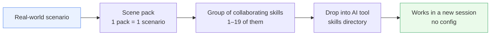

<p align="center"></p>

<h1 align="center">awesome-skillkit</h1>

<p align="center">
  <b>39 real-world scene packs · 163 curated skills · unzip &amp; drop-in —<br>your AI tool instantly knows the job.</b>
</p>

<p align="center">
  <a href="LICENSE"></a>
  
  
  
</p>

<p align="center">
  <a href="https://x33834.github.io/awesome-skillkit/"></a>
  <a href="https://github.com/x33834/awesome-skillkit/releases/latest/download/_all.zip"></a>
  <a href="https://gitcode.com/badhope/awesome-skillkit"></a>
  <a href="https://gitee.com/badhope/awesome-skillkit"></a>
</p>

<p align="center"><strong>English</strong> | <a href="README.zh-CN.md">简体中文</a> | <a href="README.ja.md">日本語</a></p>

---

## 🌐 Read this page in Chinese (one click)

The SKILL.md files inside the repo are being translated to English, but many of the docs, examples, and platform notes are still in Chinese. To read this README and the official site in Simplified Chinese instantly:

- **[🌐 Google Translate — read the official site in 中文](https://translate.google.com/translate?sl=en&tl=zh-CN&u=https://x33834.github.io/awesome-skillkit/)** *(recommended — one click, no install)*
- **[Bing Translator alternative](https://cn.bing.com/translator?from=en&to=zh-Hans)** *(paste any page URL to translate)*
- **[Immersive Translate browser extension](https://github.com/immersive-translate/immersive-translate)** *(recommended for daily use — side-by-side bilingual view of the whole site)*
- 📄 Chinese README: [**README.zh-CN.md**](README.zh-CN.md)

---

## What is this?

**awesome-skillkit** is a curated collection of **scene packs** for AI coding / agent tools (Claude Code and any tool that reads `SKILL.md`). Each pack bundles the skills that work together for **one concrete real-world scenario** — "review a PR", "ship a CI/CD pipeline", "cross-post an article to 16 Chinese platforms", "produce a short video end-to-end".

The model is deliberately simple:



- Every pack maps to a **concrete scenario**, not a vague domain like "engineering".
- Every pack bundles **the skills that actually work together** for that scenario — from a focused pair (`API Development & Testing`) to a 19-skill suite (`AI Research & Writing`) or an 18-platform publishing machine (`Content Publishing Automation`).
- Every skill's **source is attributed** per-skill in [`manifest.json`](manifest.json) and each `packs/*/pack.json` — self-authored, upstream curated (MIT), or distilled from public docs.

## Why this repo — five reasons to grab it

- **Scenario-first, not topic soup**: 163 skills / 39 packs / 20 domains / 73 chains — one pack = one concrete job you can hand to an AI ("review a PR", "cross-post an article to 16 Chinese platforms").
- **Pick your granularity**: a single `SKILL.md`, one pack zip, or everything via [`_all.zip`](https://github.com/x33834/awesome-skillkit/releases/latest/download/_all.zip) — unzip into your tool's skills directory and it works in a fresh session, no config.
- **Browse before you commit**: the [official site](https://x33834.github.io/awesome-skillkit/) searches skills / domains / packs with per-card downloads (EN · 简中 · 日本語 README + bilingual site); or ask your agent to run `find_skill.py search <keyword>`.
- **Quality you can verify**: `tools/validate_skills.py` gates the repo at **0 errors / 0 warnings** (manifest ↔ shipped zips digests locked), and CI runs the full unit-test suite on every PR.
- **Agent-native**: [`AGENTS.md`](AGENTS.md) tells any AI to check this repo for a matching skill at task start and mid-task; [`skills/skill_chains.json`](skills/skill_chains.json) documents how skills hand off inside a workflow.

## Download guide — two paths

### Path A · Browse the official site (easiest)

1. Open **<https://x33834.github.io/awesome-skillkit/>**.
2. Search by skill name, domain chip, or pack name.
3. On any skill card, click **↓ SKILL.md** to download a single file, or use the pack card to download the whole pack as a zip.
4. Grab everything at once: **↓ `_all.zip`** on the hero.

### Path B · Browse the repository directly

| What you want | Where to get it |
|---|---|
| A single `SKILL.md` | Browse [`skills/`](skills/) and open the file raw |
| One pack as a zip | [`dist/<pack-id>.zip`](dist/) (built locally) or the per-pack asset on [Releases](https://github.com/x33834/awesome-skillkit/releases/latest) |
| All packs at once | `dist/_all.zip`, or the [`_all.zip` release asset](https://github.com/x33834/awesome-skillkit/releases/latest/download/_all.zip) |
| Chinese mirrors | [GitCode](https://gitcode.com/badhope/awesome-skillkit) · [Gitee](https://gitee.com/badhope/awesome-skillkit) (same tags, release zips attached) |

> Per-pack zips are rebuilt by `python3 build.py` and attached to every GitHub Release; the GitCode / Gitee mirrors push the same tags and upload the same assets.

## Scenario pack directory (all 39 packs)

Below is the complete catalog. Each row links to its pack folder; the skill column lists every `SKILL.md` shipped inside.

| Pack ID | Pack name (EN) | 名称 (中文) | Skills | Skills included |
|---|---|---|:---:|---|
| [`ai-agent-development`](packs/ai-agent-development) | AI Agent Development | AI Agent 开发 | 5 | `agent-designer`, `mcp-server-builder`, `feature-flags-architect`, `self-eval`, `skill-tester` |
| [`ai-media-toolkit`](packs/ai-media-toolkit) | AI Media Toolkit | AI 媒体生成工具箱 | 3 | `video-generation`, `image-generation`, `music-generation` |
| [`ai-research-writing`](packs/ai-research-writing) | AI Research & Writing | AI 研究与写作 | 18 | `deep-research`, `web-search`, `paper-topic-selector`, `article-outliner`, `article-drafter`, `content-editor`, `seo-optimizer`, `lit-review`, `experiment-runner`, `arch-diagram`, `neural-net-draw`, `latex-formatter`, `self-reviewer`, `journal-adapt`, `anti-defensive`, `ai-humanizer`, `tex-cleaner`, `pub-plotter` |
| [`ai-video-pipeline`](packs/ai-video-pipeline) | AI Video Pipeline | AI 短视频生产流水线 | 9 | `video-script-writer`, `video-voice-synth`, `video-lip-sync`, `video-editor`, `video-subtitles`, `video-thumbnail`, `transition-designer`, `motion-effects-designer`, `sound-designer` |
| [`api-development`](packs/api-development) | API Development & Testing | API 开发与测试 | 2 | `api-design-reviewer`, `api-test-suite-builder` |
| [`architecture`](packs/architecture) | System Architecture | 系统架构设计 | 3 | `senior-architect`, `migration-architect`, `monorepo-navigator` |
| [`audio-studio`](packs/audio-studio) | Audio Studio | 音频工作室 | 4 | `podcast-producer`, `tts-voice-director`, `sound-designer`, `episode-publisher` |
| [`chat-prompt-craft`](packs/chat-prompt-craft) | Chat Prompt Craft | 聊天提示词工艺 | 1 | `chat-prompt-engineer` |
| [`ci-cd`](packs/ci-cd) | CI/CD Pipeline | CI/CD 流水线 | 3 | `ci-cd-pipeline-builder`, `ship-gate`, `spec-driven-workflow` |
| [`code-planning`](packs/code-planning) | Code Planning & Generation | 代码规划与生成 | 3 | `code-intent-planner`, `code-generator`, `debug-diagnoser` |
| [`code-review`](packs/code-review) | Code Review | 代码审查 | 4 | `code-reviewer`, `api-design-reviewer`, `tech-debt-tracker`, `dependency-auditor` |
| [`communication-essentials`](packs/communication-essentials) | Communication Essentials | 沟通必备 | 2 | `tactful-communication`, `decision-debiasing` |
| [`containers`](packs/containers) | Containers & Orchestration | 容器与编排 | 3 | `docker-development`, `helm-chart-builder`, `kubernetes-operator` |
| [`content-publishing`](packs/content-publishing) | Content Publishing Automation | 内容多平台发布自动化 | 18 | `zhihu-content-manager`, `cnblogs-skill`, `wechat-mp-publisher`, `juejin-publisher`, `csdn-publisher`, `jianshu-publisher`, `bilibili-publisher`, `toutiao-publisher`, `baijiahao-publisher`, `xiaohongshu-publisher`, `weibo-publisher`, `douban-publisher`, `v2ex-publisher`, `segmentfault-publisher`, `oschina-publisher`, `static-blog-deploy`, `cross-post-orchestrator`, `image-generation` |
| [`data-ml-science`](packs/data-ml-science) | Data, ML & Scientific Computing | 数据科学与科学计算 | 7 | `etl-builder`, `feature-engineer`, `model-formulator`, `model-solver`, `simulation-runner`, `result-visualizer`, `ml-pipeline` |
| [`database`](packs/database) | Database Design & Management | 数据库设计与管理 | 2 | `database-designer`, `sql-database-assistant` |
| [`dataviz-studio`](packs/dataviz-studio) | Data Viz Studio | 数据可视化工作室 | 2 | `dashboard-designer`, `chart-recommender` |
| [`de-ai-writing`](packs/de-ai-writing) | De-AI Writing | 去 AI 味写作 | 3 | `ai-trace-auditor`, `humanize-rewriter`, `personal-voice-profile` |
| [`edu-craft`](packs/edu-craft) | Edu Craft | 教育工艺 | 3 | `course-designer`, `exercise-generator`, `feynman-explainer` |
| [`github-workflow`](packs/github-workflow) | GitHub Collaboration | GitHub 协作工作流 | 3 | `git-worktree-manager`, `changelog-generator`, `code-reviewer` |
| [`growth-marketing`](packs/growth-marketing) | Growth Marketing | 增长营销 | 3 | `product-copywriter`, `campaign-designer`, `channel-adapter` |
| [`homework-autopilot`](packs/homework-autopilot) | Homework Autopilot | 作业自动驾驶 | 3 | `assignment-intake`, `solution-drafter`, `own-voice-rewrite` |
| [`image-studio`](packs/image-studio) | Image Studio | 画图工作台 | 4 | `image-prompt-engineer`, `image-generation`, `visual-style-anchor`, `image-batch-processor` |
| [`incident-response`](packs/incident-response) | Incident Response & SRE | 故障响应与 SRE | 3 | `incident-commander`, `runbook-generator`, `slo-architect` |
| [`infrastructure`](packs/infrastructure) | Infrastructure as Code | 基础设施即代码 | 3 | `terraform-patterns`, `observability-designer`, `kubernetes-operator` |
| [`knowledge-base`](packs/knowledge-base) | Knowledge Base | 个人知识库 | 2 | `personal-wiki`, `knowledge-graph-builder` |
| [`life-essentials`](packs/life-essentials) | Life Essentials | 生活必备 | 4 | `home-renovation-avoidance`, `medical-visit-guide`, `car-purchase-maintenance`, `rental-contract-guide` |
| [`memory-systems`](packs/memory-systems) | Memory Systems | 长期记忆系统 | 4 | `memory-architect`, `memory-extractor`, `memory-manager`, `memory-retriever` |
| [`office-productivity`](packs/office-productivity) | Office Productivity | 办公效率工具箱 | 10 | `ppt-builder`, `excel-assistant`, `resume-tailor`, `meeting-notes`, `internal-comms-writer`, `docx-writer`, `pdf-pipeline`, `epub-builder`, `docx-template-fill`, `career-ops-lite` |
| [`performance`](packs/performance) | Performance Profiling | 性能优化 | 1 | `performance-profiler` |
| [`security`](packs/security) | Security & Secrets | 安全与密钥管理 | 4 | `secrets-vault-manager`, `env-secrets-manager`, `pii-redactor`, `prompt-injection-guard` |
| [`skill-forge`](packs/skill-forge) | Skill Forge | 技能锻造厂 | 5 | `skill-author`, `skill-linter`, `skill-finder`, `session-handoff`, `weekly-report-generator` |
| [`tdd`](packs/tdd) | Test-Driven Development | 测试驱动开发 | 4 | `tdd-guide`, `webapp-flow-tester`, `webapp-e2e-harness`, `agent-eval-harness` |
| [`toolsmith`](packs/toolsmith) | Toolsmith | 工具与自动化 | 6 | `file-organizer`, `batch-renamer`, `format-converter`, `task-scheduler`, `invoice-organizer`, `bank-statement-reconcile` |
| [`video-design-studio`](packs/video-design-studio) | Video Design Studio | 视频设计工作室 | 5 | `storyboard-designer`, `shot-designer`, `visual-style-anchor`, `transition-designer`, `motion-effects-designer` |
| [`viral-entertainment`](packs/viral-entertainment) | Viral Entertainment | 爆款娱乐场景 | 2 | `ai-baby-podcast`, `nailong-laugh-shorts` |
| [`visual-design-studio`](packs/visual-design-studio) | Visual Design Studio | 视觉设计工作室 | 7 | `design-brief-interpreter`, `image-prompt-engineer`, `layout-spec-auditor`, `frontend-design-director`, `frontend-component-lab`, `ui-ux-accessibility`, `design-system-foundations` |
| [`web-ops`](packs/web-ops) | Web Operations | 网页操作 | 1 | `web-data-extractor` |
| [`workspace-integrations`](packs/workspace-integrations) | Workspace Integrations | 外部集成工具箱 | 4 | `notion-workspace`, `feishu-dingtalk-bridge`, `issue-tracker-sync`, `cloud-drive-manager` |

> Some skills (e.g. `api-design-reviewer`, `kubernetes-operator`, `image-generation`) appear in more than one pack because they are reused across scenarios — that is intentional.

## How to install (30 seconds)

1. **Download** the zip for the scenario you need (or grab `_all.zip`).
2. **Unzip** — you get one folder per skill, each containing a `SKILL.md`.
3. **Drag** the skill folders into your AI tool's skills directory:
   - Claude Code: `~/.claude/skills/` (global) or `.claude/skills/` (per-project)
   - Other tools with skills support: use their documented skills directory.
4. **Start a new session.** No environment variables, no config — the skill activates when the user's request matches its description.

## Use with an AI agent — check skills first

When an AI agent works in or with this repo, the global rule in [AGENTS.md](AGENTS.md) applies: **at the start of every task — and again whenever you enter a new stage or hit a sub-problem — check whether this repo already ships a matching skill, and use it if so.**

1. Scan skill descriptions: `skills/**/SKILL.md` frontmatter `description` — its trigger words ("Use when" / "Do NOT") are the matching criteria.
2. Search by keyword: `python3 skills/meta/skill-finder/scripts/find_skill.py search <keyword>`.
3. Multi-step jobs: look up the domain's orchestrator (`domains[].entry`) and the chain steps in [`skills/skill_chains.json`](skills/skill_chains.json); start from the entry and follow the chain.

No match → proceed normally; never force-fit a skill.

## Build from source

```bash
python3 build.py     # regenerates dist/<pack-id>.zip for every pack + dist/_all.zip
```

`build.py` reads [`manifest.json`](manifest.json) and `packs/*/pack.json`, stages the referenced skill folders from `skills/`, and writes the zips. The `dist/` directory is gitignored; CI / Releases attach the built artifacts.

## Contributing

See [CONTRIBUTING.md](CONTRIBUTING.md). Short version: open an issue first for new packs; every new skill needs a `SKILL.md`, attribution in `packs/*/pack.json`, and a smoke test under [`tests/`](tests/).

## License

[Apache License 2.0](LICENSE) © 2026 Morningstar202604
