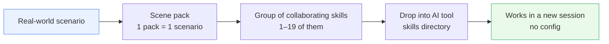

<p align="center"></p>

<h1 align="center">awesome-skillkit</h1>

<p align="center">
  <b>Two product lines, one repo:<br>57 scene packs · 418 skills for AI tools &nbsp;+&nbsp; 18 expert teams · 219 agents for multi-agent collaboration —<br>unzip &amp; drop-in, your AI tool instantly knows the job.</b>
</p>

<p align="center">
  <a href="LICENSE"></a>
  
  
  
  
</p>

<p align="center">
  <a href="https://x33834.github.io/awesome-skillkit/"></a>
  <a href="https://github.com/x33834/awesome-skillkit/releases/latest/download/_all.zip"></a>
  <a href="https://gitcode.com/badhope/awesome-skillkit"></a>
  <a href="https://gitee.com/badhope/awesome-skillkit"></a>
  <a href="https://skills.sh/x33834/awesome-skillkit"></a>
</p>

<p align="center"><strong>English</strong> | <a href="README.zh-CN.md">简体中文</a> | <a href="README.ja.md">日本語</a></p>

---

## 🌐 Read this page in Chinese (one click)

The SKILL.md files inside the repo are being translated to English, but many of the docs, examples, and platform notes are still in Chinese. To read this README and the official site in Simplified Chinese instantly:

- **[🌐 Google Translate — read the official site in 中文](https://translate.google.com/translate?sl=en&tl=zh-CN&u=https://x33834.github.io/awesome-skillkit/)** *(recommended — one click, no install)*
- **[Bing Translator alternative](https://cn.bing.com/translator?from=en&to=zh-Hans)** *(paste any page URL to translate)*
- **[Immersive Translate browser extension](https://github.com/immersive-translate/immersive-translate)** *(recommended for daily use — side-by-side bilingual view of the whole site)*
- 📄 Chinese README: [**README.zh-CN.md**](README.zh-CN.md)

---

## Two product lines — no overlap

| | **A · Scene packs (skills)** | **B · Expert Teams (专家团)** |
|---|---|---|
| **Positioning** | Tool skills for AI coding / agent tools — one pack = one real-world scenario, drop it into the skills directory and go | Multi-agent collaboration inside AI coding tools and other AI tools — role-specialised agent teams that plan, dispatch, and gate each other's work |
| **Assets** | 57 packs · 418 skills · 27 domains · 112 skill chains | 18 teams · 219 expert agents · 100 skills · orchestration protocol (pure Markdown) |
| **Location** | [`packs/`](packs/) + [`skills/`](skills/) | [`expert-teams/`](expert-teams/) |
| **Get started** | [Official site](https://x33834.github.io/awesome-skillkit/) · [`_all.zip`](https://github.com/x33834/awesome-skillkit/releases/latest/download/_all.zip) | [Browse page](https://x33834.github.io/awesome-skillkit/expert-teams.html) · [platform packages](https://x33834.github.io/awesome-skillkit/expert-teams.html#download) |

---

## What is this?

**awesome-skillkit** ships two product lines (table above). This section covers **line A — scene packs**: a curated collection of **scene packs** for AI coding / agent tools (Claude Code and any tool that reads `SKILL.md`). Each pack bundles the skills that work together for **one concrete real-world scenario** — "review a PR", "ship a CI/CD pipeline", "cross-post an article to 16 Chinese platforms", "produce a short video end-to-end".

The model is deliberately simple:


```mermaid
flowchart LR
    A[Real-world scenario] --> B[Scene pack<br/>1 pack = 1 scenario]
    B --> C[Group of collaborating skills<br/>1–19 of them]
    C --> D[Drop into AI tool<br/>skills directory]
    D --> E[Works in a new session<br/>no config]
    style A fill:#eaf2ff,stroke:#5b8def
    style E fill:#eafaea,stroke:#4caf72
```

- Every pack maps to a **concrete scenario**, not a vague domain like "engineering".
- Every pack bundles **the skills that actually work together** for that scenario — from a focused pair (`API Development & Testing`) to a 19-skill suite (`AI Research & Writing`) or an 18-platform publishing machine (`Content Publishing Automation`).
- Every skill's **source is attributed** per-skill in [`manifest.json`](manifest.json) and each `packs/*/pack.json` — self-authored, upstream curated (MIT), or distilled from public docs.

## Expert Teams — line B (multi-agent collaboration)

**Positioning**: multi-agent collaboration for AI coding tools and other AI tools. Each of the **18 teams** is a self-contained crew of role-specialised agents (lead + specialists + read-only QA) with its own workflow, phase gates and hand-off contracts — pure Markdown, platform-neutral, no runtime dependency.

- **Assets**: [`expert-teams/teams/<team>/agents/*.md`](expert-teams/teams/) (219 expert definitions), team skills `expert-teams/teams/<team>/skills/` + shared skills `expert-teams/skills/` (100 skills), the shared [`orchestration-protocol.md`](expert-teams/orchestration-protocol.md), and the cross-team router [`project-director.md`](expert-teams/project-director.md).
- **The 18 teams**: Academic Paper · Fullstack Web · Math Modeling · Software Dev · Visual Design · Content Writing · Video Production · Data Analysis · Marketing · Ecommerce Ops · Product · Finance · HR · Legal Compliance · Translation · Education Training · Audio Podcast · Game Design.
- **Use it**: read `expert-teams/project-director.md` for scenario routing, or dispatch a team lead directly — e.g. `expert-teams/teams/fullstack-web-team/agents/fullstack-team-lead.md` (from the repo root, prefix every asset path with `expert-teams/`).
- **Browse online**: [Expert Teams page](https://x33834.github.io/awesome-skillkit/expert-teams.html) — team matrix, data snapshot, install guide.

### Download platform packages (unzip & install)

| Package | What you get | How to install |
|---|---|---|
| [expert-teams-opencode.zip](https://x33834.github.io/awesome-skillkit/downloads/expert-teams-opencode.zip) | `.opencode/agents/*.md` + `.opencode/skills/*` | Unzip at your project root |
| [expert-teams-claude.zip](https://x33834.github.io/awesome-skillkit/downloads/expert-teams-claude.zip) | `.claude/agents/*.md` + `.claude/skills/*` (read-only roles mapped to `disallowedTools`) | Unzip at your project root |
| [expert-teams-cursor.zip](https://x33834.github.io/awesome-skillkit/downloads/expert-teams-cursor.zip) | Cursor plugin folder (`expert-teams/` with `.cursor-plugin/plugin.json` + agents + skills) | Install the folder as a plugin |
| [expert-teams-gemini.zip](https://x33834.github.io/awesome-skillkit/downloads/expert-teams-gemini.zip) | Gemini CLI extension (`gemini-extension.json` + `GEMINI.md` + 18 `/<team>` commands) | Install the folder as an extension |
| [expert-teams-all.zip](https://x33834.github.io/awesome-skillkit/downloads/expert-teams-all.zip) | Platform-neutral source bundle (`expert-teams/` with teams + skills + core docs) | Feed it to any file-reading agent |

Packages are reproducible builds (digest-locked in CI); rebuild anytime with `python3 expert-teams/export-platforms.py` (needs PyYAML only). The same files are mirrored under [`site/downloads/`](site/downloads/) for the GitCode / Gitee sites.

> **Provenance**: migrated on 2026-09-27 from the retired `ai-expert-teams` repository (MIT) across GitHub ×2 / GitCode / Gitee. The subtree keeps its own gates (`verify.py` / `unittest` / `build-site.py --check`) and its own [`README`](expert-teams/README.md) / [`AGENTS.md`](expert-teams/AGENTS.md).

## Why this repo — five reasons to grab it

- **Scenario-first, not topic soup**: 418 skills / 57 packs / 27 domains / 112 chains — one pack = one concrete job you can hand to an AI ("review a PR", "cross-post an article to 16 Chinese platforms").
- **Pick your granularity**: a single `SKILL.md`, one pack zip, or everything via [`_all.zip`](https://github.com/x33834/awesome-skillkit/releases/latest/download/_all.zip) — unzip into your tool's skills directory and it works in a fresh session, no config.
- **Browse before you commit**: the [official site](https://x33834.github.io/awesome-skillkit/) searches skills / domains / packs with per-card downloads (EN · 简中 · 日本語 README + bilingual site); or ask your agent to run `find_skill.py search <keyword>`.
- **Quality you can verify**: `tools/validate_skills.py` gates the repo at **0 errors / 0 warnings** (manifest ↔ shipped zips digests locked), and CI runs the full unit-test suite on every PR.
- **Agent-native**: [`AGENTS.md`](AGENTS.md) tells any AI to check this repo for a matching skill at task start and mid-task; [`skills/skill_chains.json`](skills/skill_chains.json) documents how skills hand off inside a workflow.

## Download guide — two paths

### Path A · Browse the official site (easiest)

1. Open **<https://x33834.github.io/awesome-skillkit/>**.
2. Search by skill name, domain chip, or pack name.
3. On any skill card, click **↓ SKILL.md** to download a single file, or use the pack card to download the whole pack as a zip.
4. Grab everything at once: **↓ `_all.zip`** on the hero.

### Path B · Browse the repository directly

| What you want | Where to get it |
|---|---|
| A single `SKILL.md` | Browse [`skills/`](skills/) and open the file raw |
| One pack as a zip | [`dist/<pack-id>.zip`](dist/) (built locally) or the per-pack asset on [Releases](https://github.com/x33834/awesome-skillkit/releases/latest) |
| All packs at once | `dist/_all.zip`, or the [`_all.zip` release asset](https://github.com/x33834/awesome-skillkit/releases/latest/download/_all.zip) |
| Expert teams asset (18 teams / 219 agents) | [`expert-teams/`](expert-teams/) — pure Markdown; or grab the [platform packages](https://x33834.github.io/awesome-skillkit/expert-teams.html#download) (OpenCode / Claude Code / Cursor / Gemini CLI) |
| Chinese mirrors | [GitCode](https://gitcode.com/badhope/awesome-skillkit) · [Gitee](https://gitee.com/badhope/awesome-skillkit) (same tags, release zips attached) |

> Per-pack zips are rebuilt by `python3 build.py` and attached to every GitHub Release; the GitCode / Gitee mirrors push the same tags and upload the same assets.

## Scenario pack directory (all 57 packs)

Below is the complete catalog, grouped by the **8 scene libraries** (the same two-level navigation as the official site: scene library → capability domain). Each row links to its pack folder; the skill column lists every `SKILL.md` shipped inside.

### 🛠 Software Engineering · 21 packs

| Pack ID | Pack name (EN) | 名称 (中文) | Skills | Skills included |
|---|---|---|:---:|---|
| [`api-development`](packs/api-development) | API Development & Testing | API 开发与测试 | 2 | `api-design-reviewer`, `api-test-suite-builder` |
| [`architecture`](packs/architecture) | System Architecture | 系统架构设计 | 3 | `senior-architect`, `migration-architect`, `monorepo-navigator` |
| [`ci-cd`](packs/ci-cd) | CI/CD Pipeline | CI/CD 流水线 | 3 | `ci-cd-pipeline-builder`, `ship-gate`, `spec-driven-workflow` |
| [`cloud-platforms`](packs/cloud-platforms) | Cloud Platforms | 云平台工具箱 | 12 | `azure-compute`, `azure-ai`, `azure-deploy`, `azure-messaging`, `azure-storage`, `workers-best-practices`, `cloudflare`, `wrangler`, `supabase`, `supabase-postgres-best-practices`, `firebase-basics`, `firebase-security-rules-auditor` |
| [`code-planning`](packs/code-planning) | Code Planning & Generation | 代码规划与生成 | 3 | `code-intent-planner`, `code-generator`, `debug-diagnoser` |
| [`code-quality-pro`](packs/code-quality-pro) | Code Quality Pro | 代码质量进阶 | 13 | `code-review-excellence`, `debugging-strategies`, `e2e-testing-patterns`, `error-handling-patterns`, `api-design-principles`, `architecture-patterns`, `sql-optimization-patterns`, `postgresql-table-design`, `auth-implementation-patterns`, `monorepo-management`, `deployment-pipeline-design`, `git-advanced-workflows`, `open-code-review` |
| [`code-review`](packs/code-review) | Code Review | 代码审查 | 4 | `code-reviewer`, `api-design-reviewer`, `tech-debt-tracker`, `dependency-auditor` |
| [`containers`](packs/containers) | Containers & Orchestration | 容器与编排 | 3 | `docker-development`, `helm-chart-builder`, `kubernetes-operator` |
| [`cybersecurity-pro`](packs/cybersecurity-pro) | Cybersecurity Pro | 网络安全实战精选 | 14 | `analyzing-memory-dumps-with-volatility`, `analyzing-linux-audit-logs-for-intrusion`, `analyzing-security-logs-with-splunk`, `analyzing-network-traffic-with-wireshark`, `analyzing-cobalt-strike-beacon-configuration`, `analyzing-malware-behavior-with-cuckoo-sandbox`, `analyzing-ransomware-encryption-mechanisms`, `analyzing-email-headers-for-phishing-investigation`, `analyzing-kubernetes-audit-logs`, `analyzing-azure-activity-logs-for-threats`, `analyzing-sbom-for-supply-chain-vulnerabilities`, `analyzing-threat-actor-ttps-with-mitre-attack`, `detecting-dcsync-attack-in-active-directory`, `hunting-for-lateral-movement-via-wmi` |
| [`database`](packs/database) | Database Design & Management | 数据库设计与管理 | 2 | `database-designer`, `sql-database-assistant` |
| [`engineering-playbook`](packs/engineering-playbook) | Engineering Playbook | 工程方法论手册 | 21 | `brainstorming`, `dispatching-parallel-agents`, `executing-plans`, `finishing-a-development-branch`, `receiving-code-review`, `requesting-code-review`, `subagent-driven-development`, `systematic-debugging`, `test-driven-development`, `using-git-worktrees`, `verification-before-completion`, `writing-plans`, `spec-driven-development`, `planning-and-task-breakdown`, `code-review-and-quality`, `debugging-and-error-recovery`, `shipping-and-launch`, `incremental-implementation`, `tdd`, `handoff`, `grill-me` |
| [`github-workflow`](packs/github-workflow) | GitHub Collaboration | GitHub 协作工作流 | 3 | `git-worktree-manager`, `changelog-generator`, `code-reviewer` |
| [`hf-ml-hub`](packs/hf-ml-hub) | Hugging Face ML Hub | Hugging Face 机器学习 | 11 | `hf-cli`, `huggingface-datasets`, `huggingface-papers`, `huggingface-community-evals`, `trl-training`, `train-sentence-transformers`, `huggingface-spaces`, `huggingface-gradio`, `huggingface-local-models`, `huggingface-llm-trainer`, `huggingface-best` |
| [`incident-response`](packs/incident-response) | Incident Response & SRE | 故障响应与 SRE | 3 | `incident-commander`, `runbook-generator`, `slo-architect` |
| [`infrastructure`](packs/infrastructure) | Infrastructure as Code | 基础设施即代码 | 3 | `terraform-patterns`, `observability-designer`, `kubernetes-operator` |
| [`language-standards`](packs/language-standards) | Language Standards | 语言工程规范 | 14 | `go`, `rust`, `python`, `typescript`, `cpp`, `c-sharp`, `java`, `ruby`, `php-development`, `swift`, `elixir`, `kotlin-development`, `sql-best-practices`, `bash-scripting` |
| [`performance`](packs/performance) | Performance Profiling | 性能优化 | 1 | `performance-profiler` |
| [`scientific-agent-skills`](packs/scientific-agent-skills) | Scientific Computing | 科研计算（精选） | 12 | `exploratory-data-analysis`, `experimental-design`, `hypothesis-generation`, `literature-review`, `citation-management`, `peer-review`, `polars`, `networkx`, `matplotlib`, `statistical-analysis`, `optimize-for-gpu`, `get-available-resources` |
| [`security`](packs/security) | Security & Secrets | 安全与密钥管理 | 4 | `secrets-vault-manager`, `env-secrets-manager`, `pii-redactor`, `prompt-injection-guard` |
| [`tdd`](packs/tdd) | Test-Driven Development | 测试驱动开发 | 4 | `tdd-guide`, `webapp-flow-tester`, `webapp-e2e-harness`, `agent-eval-harness` |
| [`web-ops`](packs/web-ops) | Web Operations | 网页操作 | 1 | `web-data-extractor` |

### 🤖 AI & Agents · 5 packs

| Pack ID | Pack name (EN) | 名称 (中文) | Skills | Skills included |
|---|---|---|:---:|---|
| [`ai-agent-development`](packs/ai-agent-development) | AI Agent Development | AI Agent 开发 | 5 | `agent-designer`, `mcp-server-builder`, `feature-flags-architect`, `self-eval`, `skill-tester` |
| [`caveman-toolkit`](packs/caveman-toolkit) | Caveman Toolkit | Caveman 省 token 工具包 | 7 | `caveman`, `caveman-commit`, `caveman-review`, `caveman-help`, `caveman-stats`, `caveman-compress`, `cavecrew` |
| [`chat-prompt-craft`](packs/chat-prompt-craft) | Chat Prompt Craft | 聊天提示词工艺 | 1 | `chat-prompt-engineer` |
| [`memory-systems`](packs/memory-systems) | Memory Systems | 长期记忆系统 | 4 | `memory-architect`, `memory-extractor`, `memory-manager`, `memory-retriever` |
| [`skill-forge`](packs/skill-forge) | Skill Forge | 技能锻造厂 | 5 | `skill-author`, `skill-linter`, `skill-finder`, `session-handoff`, `weekly-report-generator` |

### 🎨 Content & Creative · 13 packs

| Pack ID | Pack name (EN) | 名称 (中文) | Skills | Skills included |
|---|---|---|:---:|---|
| [`ai-media-toolkit`](packs/ai-media-toolkit) | AI Media Toolkit | AI 媒体生成工具箱 | 3 | `video-generation`, `image-generation`, `music-generation` |
| [`ai-research-writing`](packs/ai-research-writing) | AI Research & Writing | AI 研究与写作 | 18 | `deep-research`, `web-search`, `paper-topic-selector`, `article-outliner`, `article-drafter`, `content-editor`, `seo-optimizer`, `lit-review`, `experiment-runner`, `arch-diagram`, `neural-net-draw`, `latex-formatter`, `self-reviewer`, `journal-adapt`, `anti-defensive`, `ai-humanizer`, `tex-cleaner`, `pub-plotter` |
| [`ai-video-pipeline`](packs/ai-video-pipeline) | AI Video Pipeline | AI 短视频生产流水线 | 9 | `video-script-writer`, `video-voice-synth`, `video-lip-sync`, `video-editor`, `video-subtitles`, `video-thumbnail`, `transition-designer`, `motion-effects-designer`, `sound-designer` |
| [`audio-studio`](packs/audio-studio) | Audio Studio | 音频工作室 | 4 | `podcast-producer`, `tts-voice-director`, `episode-publisher`, `sound-designer` |
| [`content-publishing`](packs/content-publishing) | Content Publishing Automation | 内容多平台发布自动化 | 18 | `zhihu-content-manager`, `cnblogs-skill`, `wechat-mp-publisher`, `juejin-publisher`, `csdn-publisher`, `jianshu-publisher`, `bilibili-publisher`, `toutiao-publisher`, `baijiahao-publisher`, `xiaohongshu-publisher`, `weibo-publisher`, `douban-publisher`, `v2ex-publisher`, `segmentfault-publisher`, `oschina-publisher`, `static-blog-deploy`, `cross-post-orchestrator`, `image-generation` |
| [`creator-boosters`](packs/creator-boosters) | Creator Boosters | 创作增强单品 | 5 | `humanizer`, `diagram-design`, `archify`, `archify-review`, `video-shotcraft` |
| [`de-ai-writing`](packs/de-ai-writing) | De-AI Writing | 去 AI 味写作 | 3 | `ai-trace-auditor`, `humanize-rewriter`, `personal-voice-profile` |
| [`image-studio`](packs/image-studio) | Image Studio | 画图工作台 | 4 | `image-prompt-engineer`, `image-generation`, `visual-style-anchor`, `image-batch-processor` |
| [`video-code`](packs/video-code) | Code-Driven Video (HyperFrames) | 代码化视频（HyperFrames） | 5 | `hyperframes`, `hyperframes-cli`, `hyperframes-animation`, `hyperframes-audio`, `hyperframes-keyframes` |
| [`video-design-studio`](packs/video-design-studio) | Video Design Studio | 视频设计工作室 | 5 | `storyboard-designer`, `shot-designer`, `visual-style-anchor`, `transition-designer`, `motion-effects-designer` |
| [`viral-entertainment`](packs/viral-entertainment) | Viral Entertainment | 爆款娱乐场景 | 2 | `ai-baby-podcast`, `nailong-laugh-shorts` |
| [`visual-design-studio`](packs/visual-design-studio) | Visual Design Studio | 视觉设计工作室 | 7 | `design-brief-interpreter`, `image-prompt-engineer`, `layout-spec-auditor`, `frontend-design-director`, `frontend-component-lab`, `ui-ux-accessibility`, `design-system-foundations` |
| [`wechat-longform`](packs/wechat-longform) | WeChat Longform Studio | 微信长文工作室 | 10 | `baoyu-post-to-wechat`, `baoyu-format-markdown`, `baoyu-markdown-to-html`, `baoyu-cover-image`, `baoyu-article-illustrator`, `baoyu-infographic`, `baoyu-wechat-summary`, `baoyu-translate`, `baoyu-xhs-images`, `baoyu-slide-deck` |

### 📊 Data & Research · 2 packs

| Pack ID | Pack name (EN) | 名称 (中文) | Skills | Skills included |
|---|---|---|:---:|---|
| [`data-ml-science`](packs/data-ml-science) | Data, ML & Scientific Computing | 数据科学与科学计算 | 7 | `etl-builder`, `feature-engineer`, `model-formulator`, `model-solver`, `simulation-runner`, `result-visualizer`, `ml-pipeline` |
| [`dataviz-studio`](packs/dataviz-studio) | Data Viz Studio | 数据可视化工作室 | 2 | `dashboard-designer`, `chart-recommender` |

### 🗂 Office & Productivity · 7 packs

| Pack ID | Pack name (EN) | 名称 (中文) | Skills | Skills included |
|---|---|---|:---:|---|
| [`communication-essentials`](packs/communication-essentials) | Communication Essentials | 沟通基本功 | 2 | `tactful-communication`, `decision-debiasing` |
| [`feishu-suite`](packs/feishu-suite) | Feishu Suite (official Lark CLI) | 飞书套件（官方 CLI） | 28 | `lark-approval`, `lark-apps`, `lark-attendance`, `lark-base`, `lark-calendar`, `lark-contact`, `lark-doc`, `lark-drive`, `lark-event`, `lark-im`, `lark-mail`, `lark-markdown`, `lark-meeting`, `lark-minutes`, `lark-note`, `lark-okr`, `lark-openapi-explorer`, `lark-shared`, `lark-sheets`, `lark-skill-maker`, `lark-slides`, `lark-task`, `lark-vc`, `lark-vc-agent`, `lark-whiteboard`, `lark-wiki`, `lark-workflow-meeting-summary`, `lark-workflow-standup-report` |
| [`google-workspace`](packs/google-workspace) | Google Workspace | Google Workspace 套件 | 27 | `gws-calendar`, `gws-calendar-agenda`, `gws-calendar-insert`, `gws-docs`, `gws-docs-write`, `gws-drive`, `gws-drive-upload`, `gws-gmail`, `gws-gmail-forward`, `gws-gmail-read`, `gws-gmail-reply`, `gws-gmail-reply-all`, `gws-gmail-send`, `gws-gmail-triage`, `gws-gmail-watch`, `gws-people`, `gws-shared`, `gws-sheets`, `gws-sheets-append`, `gws-sheets-read`, `gws-tasks`, `gws-workflow`, `gws-workflow-email-to-task`, `gws-workflow-file-announce`, `gws-workflow-meeting-prep`, `gws-workflow-standup-report`, `gws-workflow-weekly-digest` |
| [`knowledge-base`](packs/knowledge-base) | Knowledge Base | 个人知识库 | 2 | `personal-wiki`, `knowledge-graph-builder` |
| [`office-productivity`](packs/office-productivity) | Office Productivity | 办公效率工具箱 | 10 | `ppt-builder`, `excel-assistant`, `resume-tailor`, `meeting-notes`, `internal-comms-writer`, `docx-writer`, `pdf-pipeline`, `epub-builder`, `docx-template-fill`, `career-ops-lite` |
| [`toolsmith`](packs/toolsmith) | Toolsmith | 工具与自动化 | 6 | `file-organizer`, `batch-renamer`, `format-converter`, `task-scheduler`, `invoice-organizer`, `bank-statement-reconcile` |
| [`workspace-integrations`](packs/workspace-integrations) | Workspace Integrations | 外部集成工具箱 | 4 | `notion-workspace`, `feishu-dingtalk-bridge`, `issue-tracker-sync`, `cloud-drive-manager` |

### 📈 Business & Growth · 6 packs

| Pack ID | Pack name (EN) | 名称 (中文) | Skills | Skills included |
|---|---|---|:---:|---|
| [`cmo-suite`](packs/cmo-suite) | CMO & C-Suite Suite | CMO 与高管套件 | 12 | `landing`, `linkedin-analytics`, `linkedin-content`, `linkedin-engagement`, `linkedin-profile`, `linkedin-strategy`, `ceo-advisor`, `cfo-advisor`, `cmo-advisor`, `cto-advisor`, `chro-advisor`, `ciso-advisor` |
| [`company-playbooks`](packs/company-playbooks) | Company Playbooks | 公司运营手册 | 13 | `scenario-planning`, `market-entry`, `agent-hierarchy`, `operating-cadence`, `process-design`, `business-continuity-and-resilience`, `vendor-management`, `service-level-management`, `program-management`, `dependency-and-risk-management`, `estimating-and-contingency`, `unit-economics`, `pricing-and-packaging` |
| [`growth-marketing`](packs/growth-marketing) | Growth Marketing | 增长营销 | 3 | `product-copywriter`, `campaign-designer`, `channel-adapter` |
| [`gtm-growth`](packs/gtm-growth) | GTM Growth Suite | GTM 增长套件 | 16 | `meta-ads-analyzer`, `google-search-ads-builder`, `ad-angle-miner`, `competitor-ad-intelligence`, `ad-to-landing-page-auditor`, `paid-channel-prioritizer`, `launch-positioning-builder`, `brand-voice-extractor`, `battlecard-generator`, `competitor-intel`, `competitive-pricing-intel`, `campaign-brief-generator`, `content-repurposing`, `seo-opportunity-finder`, `github-repo-signals`, `community-signals` |
| [`knowledge-work`](packs/knowledge-work) | Knowledge Work Suite | 知识工作套件 | 21 | `comp-analysis`, `interview-prep`, `onboarding`, `performance-review`, `policy-lookup`, `recruiting-pipeline`, `review-contract`, `legal-risk-assessment`, `compliance-check`, `triage-nda`, `variance-analysis`, `audit-support`, `process-optimization`, `risk-assessment`, `status-report`, `ticket-triage`, `draft-response`, `kb-article`, `user-research`, `research-synthesis`, `ux-copy` |
| [`product-management`](packs/product-management) | Product Management | 产品管理 | 14 | `create-prd`, `outcome-roadmap`, `prioritization-frameworks`, `user-stories`, `job-stories`, `stakeholder-map`, `pre-mortem`, `sprint-plan`, `north-star-metric`, `competitive-battlecard`, `market-sizing`, `user-personas`, `to-spec`, `triage` |

### 🎓 Learning & Education · 2 packs

| Pack ID | Pack name (EN) | 名称 (中文) | Skills | Skills included |
|---|---|---|:---:|---|
| [`edu-craft`](packs/edu-craft) | Edu Craft | 教育工艺 | 3 | `course-designer`, `exercise-generator`, `feynman-explainer` |
| [`homework-autopilot`](packs/homework-autopilot) | Homework Autopilot | 作业自动驾驶 | 3 | `assignment-intake`, `solution-drafter`, `own-voice-rewrite` |

### 🏠 Life & Personal · 1 pack

| Pack ID | Pack name (EN) | 名称 (中文) | Skills | Skills included |
|---|---|---|:---:|---|
| [`life-essentials`](packs/life-essentials) | Life Essentials | 生活必备 | 4 | `home-renovation-avoidance`, `medical-visit-guide`, `car-purchase-maintenance`, `rental-contract-guide` |

> Some skills (e.g. `api-design-reviewer`, `kubernetes-operator`, `image-generation`) appear in more than one pack because they are reused across scenarios — that is intentional.

## How to install (30 seconds)

> **⚡ Fastest route (skills.sh ecosystem)**: `npx skills add x33834/awesome-skillkit` — one command installs into Claude Code / Cursor / Copilot and 20+ other tools (`-l` lists all 418 skills first, `-s <skill>` installs one, `-s '*'` installs everything).

1. **Download** the zip for the scenario you need (or grab `_all.zip`).
2. **Unzip** — you get one folder per skill, each containing a `SKILL.md`.
3. **Drag** the skill folders into your AI tool's skills directory:
   - Claude Code: `~/.claude/skills/` (global) or `.claude/skills/` (per-project)
   - Other tools with skills support: use their documented skills directory.
4. **Start a new session.** No environment variables needed. The skill activates when the user's request matches its description — and to make your agent *actively* route to skills (instead of waiting for a passive match), spend one minute adding the [skill-first global rule](GLOBAL-RULES.md) to your global instruction file.

## Use with an AI agent — check skills first

When an AI agent works in or with this repo, the global rule in [AGENTS.md](AGENTS.md) applies. **Skills installed into your tool's directory do NOT carry that rule with them** — paste the out-of-repo version from [GLOBAL-RULES.md](GLOBAL-RULES.md) into your global instruction file. In-repo rule: **at the start of every task — and again whenever you enter a new stage or hit a sub-problem — check whether this repo already ships a matching skill, and use it if so.**

1. Scan skill descriptions: `skills/**/SKILL.md` frontmatter `description` — its trigger words ("Use when" / "Do NOT") are the matching criteria.
2. Search by keyword: `python3 skills/meta/skill-finder/scripts/find_skill.py search <keyword>`.
3. Multi-step jobs: look up the domain's orchestrator (`domains[].entry`) and the chain steps in [`skills/skill_chains.json`](skills/skill_chains.json); start from the entry and follow the chain.

No match → proceed normally; never force-fit a skill.

## Build from source

```bash
python3 build.py     # regenerates dist/<pack-id>.zip for every pack + dist/_all.zip
```

`build.py` reads [`manifest.json`](manifest.json) and `packs/*/pack.json`, stages the referenced skill folders from `skills/`, and writes the zips. The `dist/` directory is gitignored; CI / Releases attach the built artifacts.

## Contributing

See [CONTRIBUTING.md](CONTRIBUTING.md). Short version: open an issue first for new packs; every new skill needs a `SKILL.md`, attribution in `packs/*/pack.json`, and a smoke test under [`tests/`](tests/).

## License

[Apache License 2.0](LICENSE) © 2026 Morningstar202604
