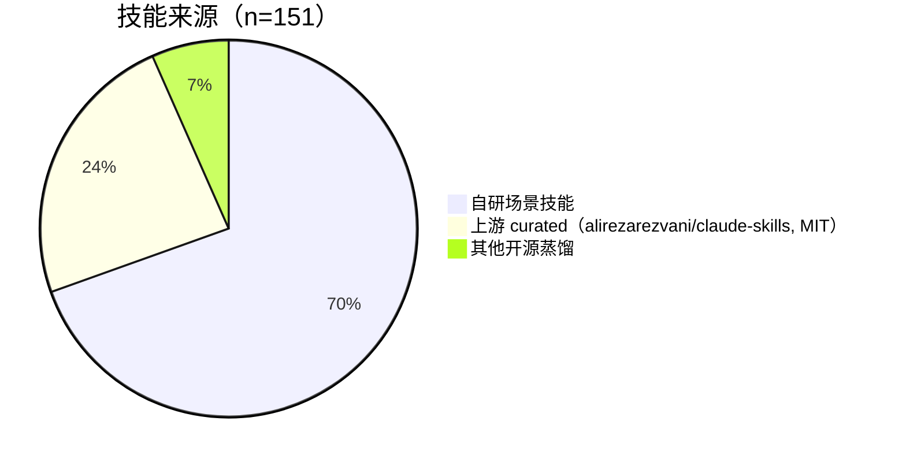
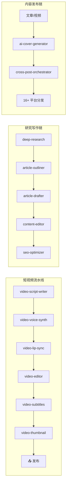

<p align="center"></p>

# awesome-skillkit · 渡

[](LICENSE)


[English](README.md) | **中文** | [日本語](README.ja.md)

> 🌐 **在线浏览 / 下载**：站点源码仓库（在 GitCode 开启 Pages 即得可访问站点，内容已同步至 v0.18.0）：
> [gitcode.com/badhope/skillkit-site](https://gitcode.com/badhope/skillkit-site)
> 单包 zip 与全量 `_all.zip` 见各平台 Release（见下方「三平台同步状态」）。
> 部署说明：[docs/DEPLOY-SITE.md](docs/DEPLOY-SITE.md)

面向 AI 工具的精选**场景技能包**合集。**一个场景包 = 一个真实工作场景，里面是一组协同工作的 skill。** 下载 zip → 解压 → 把 skill 文件夹拖进 AI 工具的 skills 目录 → 开箱即用。

## 它解决什么（定位）

**场景即答案——落到具体平台与工具，而不是宽泛领域。**


- 每个场景包对应一个**具体场景**（"审 PR"、"搭 CI/CD"、"发博客"），而非"工程""营销"这种空泛词。
- 每个场景包打包**协同工作的 skill 组合**——小到精简一对，大到 18 个技能的 `Content Publishing Automation` 全家桶（端到端覆盖 16 个中文平台）。
- 每个 skill 的**来源都明确标注**（上游 curated / 自研 / 开源蒸馏），不藏不混。

## 数字一览

> **151 个 skill** · **36 个场景包** · **18 个链域 / 57 条技能链** · v0.18.0 · Apache-2.0

**来源构成**（自研为主，上游为辅，全部可溯源）：



**按场景包规模分布**（█ = 1 个 skill，共 36 包）：

| 场景包 | 技能数 | 规模 |
|--------|:---:|------|
| AI Research & Writing | 19 | ███████████████████ |
| Content Publishing Automation | 18 | ██████████████████ |
| Office Productivity | 8 | ████████ |
| Data, ML & Scientific Computing | 7 | ███████ |
| AI Video Pipeline | 6 | ██████ |
| AI Agent Development | 5 | █████ |
| Code Review | 5 | █████ |
| AI Media Toolkit | 4 | ████ |
| Image Studio | 4 | ████ |
| Memory Systems | 4 | ████ |
| Toolsmith | 4 | ████ |
| Video Design Studio | 4 | ████ |
| Visual Design Studio | 4 | ████ |
| Workspace Integrations | 4 | ████ |
| System Architecture | 3 | ███ |
| Audio Studio | 3 | ███ |
| CI/CD Pipeline | 3 | ███ |
| Code Planning & Generation | 3 | ███ |
| Containers & Orchestration | 3 | ███ |
| De-AI Writing | 3 | ███ |
| Edu Craft | 3 | ███ |
| GitHub Collaboration | 3 | ███ |
| Growth Marketing | 3 | ███ |
| Homework Autopilot | 3 | ███ |
| Incident Response & SRE | 3 | ███ |
| Infrastructure as Code | 3 | ███ |
| Skill Forge | 3 | ███ |
| API Development & Testing | 2 | ██ |
| Database Design & Management | 2 | ██ |
| Data Viz Studio | 2 | ██ |
| Knowledge Base | 2 | ██ |
| Security & Secrets | 2 | ██ |
| Test-Driven Development | 2 | ██ |
| Viral Entertainment | 2 | ██ |
| Chat Prompt Craft | 1 | █ |
| Performance Profiling | 1 | █ |

## 30 秒上手

1. 📦 从 **Release** 下载你需要的场景包 zip（或本地 `python3 build.py` 生成 `dist/*.zip`）。
2. 📂 解压——得到**多个 skill 文件夹**（每个含 `SKILL.md`）。
3. 🧲 把 skill 文件夹**拖入** AI 工具的 skills 目录：
   - Claude Code：`~/.claude/skills/`（全局）或项目内 `.claude/skills/`
   - 其他支持 skills 的工具：用其对应的 skills 目录
4. 🚀 开新会话即可用，无需任何配置。

## 场景包全景


### 工程与编程

| 场景包 | 技能数 | 场景 | 来源 |
|--------|:---:|------|:---:|
| AI Agent Development | 5 | 生产级 Agent、多智能体、MCP、特性开关、自评估 | 上游 |
| Code Review | 5 | PR 审查、代码质量、依赖审计、技术债 | 上游 |
| System Architecture | 3 | 系统架构、零停机迁移、monorepo | 上游 |
| CI/CD Pipeline | 3 | CI/CD 流水线、发布门、spec 驱动开发 | 上游 |
| Code Planning & Generation | 3 | 模糊需求→结构化计划→生成→失败诊断 | 自研 |
| Containers & Orchestration | 3 | Dockerfile、compose、Helm、K8s operator | 上游 |
| GitHub Collaboration | 3 | 并行 worktree、约定式 changelog、PR 审查 | 上游 |
| Incident Response & SRE | 3 | 事故指挥、runbook、SLO/错误预算 | 上游 |
| Infrastructure as Code | 3 | Terraform 模式、可观测性、K8s | 上游 |
| API Development & Testing | 2 | REST API 设计审查、契约/集成测试 | 上游 |
| Database Design & Management | 2 | 库设计、ERD、迁移、SQL 优化 | 上游 |
| Security & Secrets | 2 | 密钥库、环境变量卫生 | 上游 |
| Test-Driven Development | 2 | 单测、fixture、mock、红绿重构、Playwright 流程测试 | 上游 |
| Chat Prompt Craft | 1 | 对话 AI 提示词工程：五要素公式、agent 系统提示、反向约束 | 自研 |
| Performance Profiling | 1 | Node/Python/Go 的 CPU/内存/IO 剖析 | 上游 |

### 研究与写作

| 场景包 | 技能数 | 场景 | 来源 |
|--------|:---:|------|:---:|
| AI Research & Writing | 19 | 从问题到成稿：多轮研究、选题、大纲、草稿、润色、SEO、图表、LaTeX | 自研 |
| De-AI Writing | 3 | AI 痕迹审计、人声改写、个人声纹档案（降低 AI 感） | 自研 |

### 内容发布

| 场景包 | 技能数 | 场景 | 来源 |
|--------|:---:|------|:---:|
| Content Publishing Automation | 18 | 16+ 中文平台文章/视频发布、编辑、跨平台分发、AI 封面 | 自研 |

### 视频创作

| 场景包 | 技能数 | 场景 | 来源 |
|--------|:---:|------|:---:|
| AI Video Pipeline | 6 | 短视频全链路：脚本→配音→对口型→剪辑→字幕→封面→发布 | 自研 |
| AI Media Toolkit | 4 | 文/图生视频、生图、生乐、封面（本地生成网关） | 自研 |
| Video Design Studio | 4 | 视频前期：分镜、镜头配方、prompt 工程、风格锚点 | 自研 |
| Viral Entertainment | 2 | 会说话宝宝播客、龙崽 meme 短片（角色一致性） | 自研 |

### 图像与设计

| 场景包 | 技能数 | 场景 | 来源 |
|--------|:---:|------|:---:|
| Image Studio | 4 | 图像创作工作台：prompt、重绘、扩图、超分 | 自研 |
| Visual Design Studio | 4 | brief→spec→prompt→layout 审计，设计总监两遍工作流 | 自研 |

### 音频

| 场景包 | 技能数 | 场景 | 来源 |
|--------|:---:|------|:---:|
| Audio Studio | 3 | 播客链：脚本→配音→发布（Kokoro/Qwen3-TTS） | 自研 |

### 数据科学

| 场景包 | 技能数 | 场景 | 来源 |
|--------|:---:|------|:---:|
| Data, ML & Scientific Computing | 7 | ETL、特征工程、建模求解、仿真、可视化、ML 流水线 | 自研 |

### 办公生产力

| 场景包 | 技能数 | 场景 | 来源 |
|--------|:---:|------|:---:|
| Office Productivity | 8 | PPT、Excel、Word、PDF、简历、纪要、内部通讯 | 自研 |

### 增长营销

| 场景包 | 技能数 | 场景 | 来源 |
|--------|:---:|------|:---:|
| Growth Marketing | 3 | 电商营销链：文案框架、活动策划、渠道适配 | 自研 |

### 教育

| 场景包 | 技能数 | 场景 | 来源 |
|--------|:---:|------|:---:|
| Edu Craft | 3 | 精通教学链：课程→练习→费曼讲解 | 自研 |
| Homework Autopilot | 3 | 一键作业完成（有温度版，降低冷血感） | 自研 |

### 记忆系统

| 场景包 | 技能数 | 场景 | 来源 |
|--------|:---:|------|:---:|
| Memory Systems | 4 | 长期记忆：设计/抽取/管理/检索（mem0/letta 蒸馏） | 自研 |

### 工具与自动化

| 场景包 | 技能数 | 场景 | 来源 |
|--------|:---:|------|:---:|
| Toolsmith | 4 | 文件整理、批量重命名、格式转换、定时任务（全部 dry-run 优先） | 自研 |

### 元技能

| 场景包 | 技能数 | 场景 | 来源 |
|--------|:---:|------|:---:|
| Skill Forge | 3 | 技能生成、规范校验（CI 门禁）、技能检索与装配 | 自研 |

### 外部集成

| 场景包 | 技能数 | 场景 | 来源 |
|--------|:---:|------|:---:|
| Workspace Integrations | 4 | Notion / 飞书·钉钉·企业微信 / Jira·Linear·GitHub Issues / 云盘归档 | 自研 |

### 个人知识库

| 场景包 | 技能数 | 场景 | 来源 |
|--------|:---:|------|:---:|
| Knowledge Base | 2 | 笔记库构建（索引/检索/体检）、知识图谱抽取与导出 | 自研 |

### 数据可视化

| 场景包 | 技能数 | 场景 | 来源 |
|--------|:---:|------|:---:|
| Data Viz Studio | 2 | CSV 剖析 → 仪表盘生成（零外部依赖）、图表选择词库 | 自研 |

## 细节词库（本仓库差异化亮点）

很多生成类 skill 的成败在"描述够不够细"。我们为高频场景沉淀了**高密度细节词库**——术语 + 效果/情绪 + 何时用 + 示例，写 prompt 前先查：

| 词库文件 | 领域 | 覆盖内容 |
|----------|:---:|---------|
| `cinematography-lexicon.md` | 视频 | 17 种转场 / 动作动词空间语义 / 微表情表演 / 速度节奏 / 五模型方言 / 迭代修复对照 ||| `visual-detail-lexicon.md` | 图像 | 三层光照 30+ 词条 / 构图 / 焦段透视性格 / 材质堆叠公式 / 静态图动势词 ||| `music-style-lexicon.md` | 音乐 | 五槽位 Style 公式 / 曲风族谱 / 情绪×BPM 禁配 / 结构·人声·乐器 tag 全集 / 负面清单 ||| `emotion-delivery-lexicon.md` | 语音 | 情绪→文案手法 / 标点停顿层级 / 重音位置 / 双人对话节奏 ||| `copywriting-formulas.md` | 文案 | 10 型标题公式 / PAS·FAB·AIDA 结构 / CTA 按场景 / 四平台调性差异 ||| `layout-and-chart-rules.md` | PPT | 字号层级表 / 每页信息密度红线 / 图表选择决策树 / WCAG 对比度 ||| `camera-vocabulary.md` | 视频 | 运镜景别 / 基础转场（入门层） ||| `rest_design_rules.md` | API | REST 设计审查规则集 ||| `bounded_autonomy_rules.md` | CI/CD | 边界自治规则（人类审批节点） ||| `platform-rules.md` | SEO | 各平台发布规则与敏感词 |

> 例子：视频 `cinematography-lexicon.md` 把"转场"拆成 17 种（smash cut / match cut / J-cut / invisible cut…），并配"动作动词空间语义表"——`approaches` 与 `comes` 级别的差异都写明，让 AI 看得懂"要什么镜头"。

## 典型技能链（不止单点，而是流水线）



`skill_chains.json` 内置 **18 个链域 / 57 条链**，把"该先调谁、谁接谁"固化下来，跨模块交叉调用不迷路。

## 三平台同步状态

| 平台 | 仓库 | 代码同步 | Release / 附件 | 状态 |
|------|------|:---:|:---:|------|
| GitCode | `badhope/awesome-skillkit` | ✅ 至 `0.18.0` | ✅ 已建 | 正常 |
| Gitee | `badhope/awesome-skillkit` | ✅ 至 `0.18.0` | ✅ v0.18.0 共 32 个 zip 附件 | 正常 |
| GitHub | `x33834/awesome-skillkit` | ⚠️ 待本地推送 | ⚠️ 无 | 沙箱网络层限制，需你本地 `git push origin main --follow-tags`（token 需 repo+workflow 权限） |
| 站点 | `badhope/skillkit-site` | ✅ 已同步 v0.18.0 | — | 在 GitCode 开启 Pages 即可访问 |

> GitHub 因构建环境出口 ACL 在 TLS 握手层切断，无法从本环境直推；代码与 Release 内容已通过 GitCode / Gitee 完整托管，本地一条命令即可补齐 GitHub。

## 目录结构

```
packs/              # 场景包定义（每场景一个目录，pack.json 含场景元数据+技能清单+来源）
skills/             # 所有 skill 的唯一源码（多层级分类）
  ├─ programming/   # 上游 curated（alirezarezvani，33 个编程技能）
  ├─ writing/       # 自研场景技能（内容发布/研究/去 AI 味…）
  ├─ video/ design/ audio/ marketing/ education/ scenarios/ …
  └─ skill_chains.json  # 13 域 / 48 条技能链
dist/               # 构建产物：每包一个 zip（gitignored）
```

## 来源与署名

两条来源轨道，全部在 [manifest.json](manifest.json)、各 `packs/*/pack.json` 与 [SOURCES.md](SOURCES.md) 中逐 skill 署名：

- **自研场景技能（105 个）**：`skills/writing/`、`scenarios/`、`design/`、`audio/` 等。中国平台自动化、视频/图像/音频流水线、去 AI 味写作、记忆系统、作业自动驾驶等——均为上游未覆盖的原创工作流，自带可执行检查脚本与单测，默认 dry-run。
- **上游 curated（36 个，MIT）**：来自 [alirezarezvani/claude-skills](https://github.com/alirezarezvani/claude-skills)，覆盖编程/工程类技能。
- **其他开源蒸馏（10 个）**：方法论蒸馏自 Anthropic 公开技能文档、mem0/letta/Claude memory tool、Kokoro/Qwen3-TTS 生态等，均在 `references/sources-and-methodology.md` 署名，**零内容复制**。

## 构建与发版

```bash
python3 build.py            # 单一构建入口：生成 dist/*.zip（每包一个），并输出 dist/_all.zip
python3 tools/release.py 0.18.0 --commit   # 校验 CHANGELOG → 升版 → 提交 → 打 tag
git push origin main --follow-tags            # 推代码 + 三个版本 tag
# 在 Gitee / GitCode 建 Release 并上传 dist/*.zip（manifest.json 的 version 为唯一事实来源）
```

## License

[Apache License 2.0](LICENSE) © 2026 Morningstar202604
