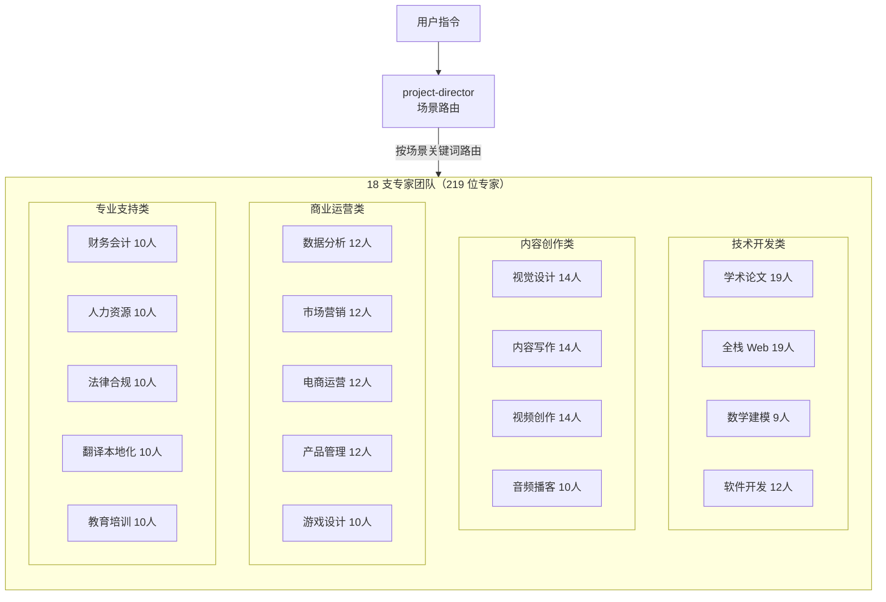

<div align="center">
  <h1>expert-teams · 专家团</h1>
  <p>219 位 AI 专家即插即用 · 18 大领域全覆盖 · 100 个开箱技能 · 纯 Markdown 平台中立 · 接入任意 AI agent 即用</p>
  
  
  
  
  <br />
  <p>
    <a href="https://github.com/X33834/awesome-skillkit/tree/main/expert-teams">GitHub (X33834)</a> ·
    <a href="https://github.com/Morningstar202604/awesome-skillkit/tree/main/expert-teams">GitHub (Morningstar202604)</a> ·
    <a href="https://gitcode.com/badhope/awesome-skillkit/tree/main/expert-teams">GitCode</a> ·
    <a href="https://gitee.com/badhope/awesome-skillkit/tree/main/expert-teams">Gitee</a>
  </p>
  <p>
    <a href="https://x33834.github.io/awesome-skillkit/expert-teams.html"><b>官网在线浏览（awesome-skillkit 子页）</b></a>
  </p>
</div>

> **迁移说明（2026-09-27）**：本目录整体自独立仓库 `ai-expert-teams` 迁入 `awesome-skillkit`；原仓库已在 GitHub（X33834 / Morningstar202604）、GitCode、Gitee 四个平台下线，全部资产在本目录内完整保留、原样可用。原仓库 CI（`verify.py` + `unittest` + 官网防漂移检查）已并入 `awesome-skillkit` 根 CI 的 `expert-teams` 作业；根级 `.editorconfig` / `.gitattributes` 与根仓库同款，沿用根配置，不再重复放置。
>
> **路径基准**：本目录内所有文档中的相对路径（`teams/...`、`skills/...`、`orchestration-protocol.md`、`project-director` 等）均以**本目录（`expert-teams/`）为根**；在 `awesome-skillkit` 仓库根引用或派发子 agent 时，请加 `expert-teams/` 前缀。示例：路径 ID `teams/hr-team/agents/hr-team-lead` → 仓库内实际路径 `expert-teams/teams/hr-team/agents/hr-team-lead.md`；命令 `python3 verify.py` → `python3 expert-teams/verify.py`。

---

## 这是什么

一套**平台中立的通用专家团队资产**：把 18 个专家团队、219 位专家、100 个 Skill 全部写成纯 Markdown 定义，自带 Workflow、Phase 门禁、Checkpoint 与交接模板。

**无运行时依赖、不绑定任何具体 AI 产品或框架**——任何具备「读取文件 / 派发子 agent / 加载外部提示词」能力的 AI agent，都可以直接读取并扮演这些专家。

> 历史说明：本目录资产最初源自 opencode 生态，现已重写为平台中立资产，接入方式与运行时均不再依赖任何特定产品；2026-09-27 自独立仓库 `ai-expert-teams` 整体迁入 `awesome-skillkit`。

---

## 架构图



---

## 下载安装包（四平台 + 全量源包）

不想手动导出？直接下载（随 awesome-skillkit 站点分发，同一份文件也镜像在仓库 `site/downloads/`）：

| 安装包 | 内容 | 安装方式 |
|---|---|---|
| [expert-teams-opencode.zip](https://x33834.github.io/awesome-skillkit/downloads/expert-teams-opencode.zip) | `.opencode/agents/*.md` + `.opencode/skills/*` | 在项目根解压 |
| [expert-teams-claude.zip](https://x33834.github.io/awesome-skillkit/downloads/expert-teams-claude.zip) | `.claude/agents/*.md` + `.claude/skills/*` | 在项目根解压 |
| [expert-teams-cursor.zip](https://x33834.github.io/awesome-skillkit/downloads/expert-teams-cursor.zip) | Cursor 插件目录（`.cursor-plugin/plugin.json` + agents + skills） | 作为插件目录安装 |
| [expert-teams-gemini.zip](https://x33834.github.io/awesome-skillkit/downloads/expert-teams-gemini.zip) | Gemini CLI 扩展（`gemini-extension.json` + `GEMINI.md` + 18 个 `/<团队>` 命令） | 作为扩展目录安装 |
| [expert-teams-all.zip](https://x33834.github.io/awesome-skillkit/downloads/expert-teams-all.zip) | 平台中立源包（`expert-teams/`：teams + skills + 核心文档） | 喂给任意读文件型 agent |

本地重建（可复现构建，摘要锁定）：`python3 expert-teams/export-platforms.py` → 产物在 `expert-teams/dist/zips/`。

---

## 快速开始

> 想先看全貌？访问官网在线浏览：https://x33834.github.io/awesome-skillkit/expert-teams.html

### 接入你自己的 agent

本目录是纯 Markdown 资产，**不需要安装脚本、不需要配置文件、不依赖任何特定产品**。按你所用 agent 的能力，三选一接入：

**方式一：直接读团队 Markdown（推荐给读文件型 agent）**

agent 直接读取 `teams/<team>/agents/*.md` 即可获得该专家的完整定义（角色、输入输出规范、Workflow、交接要求），按文件内容扮演对应专家：

```
teams/academic-paper-team/agents/academic-team-lead.md
teams/fullstack-web-team/agents/fullstack-team-lead.md
teams/math-modeling-team/agents/math-team-lead.md
```

无需软链、无需注册，把文件内容喂给 agent 即可。

**方式二：导出 system prompt 后喂入（推荐给只接受单段提示词的 agent）**

运行导出脚本，把各 agent 定义批量导出为 system prompt 文本 / JSON（在仓库根运行，或先 `cd expert-teams`）：

```bash
python3 expert-teams/export-agents.py
```

产物默认输出到 `dist/` 目录（每个 agent 一个 system prompt 文件，外加一份汇总 JSON）。把对应 agent 的 system prompt 粘贴到你的 agent 配置，或作为系统提示 / 上下文喂入即可。

**方式三：整目录挂给目录式 agent 框架**

把 `teams/` 目录整体复制（或软链）给支持「目录式加载 agent 定义」的框架——框架只要约定从某一目录发现 `*.md` agent 文件即可。`skills/` 与 `teams/*/skills/` 同理：**skill 目录即资产**，任何 agent 按需读取其中的 `SKILL.md` 即可使用该技能。

> 三种方式任选其一。本目录不提供、也不需要任何产品专属的安装或配置步骤。

### 直接调用

在支持子 agent 调度的框架中，按**路径 ID**（agent Markdown 文件相对**本目录**的路径，去掉 `.md`；在仓库根使用时加 `expert-teams/` 前缀，如 `expert-teams/project-director`）派发：

```text
# 多场景自动路由入口（不确定场景时先用它）
project-director

# 明确单一场景 → 直派对应 Team-lead
teams/fullstack-web-team/agents/fullstack-team-lead     # 做个电商 Web 应用上线
teams/math-modeling-team/agents/math-team-lead         # 全程托管国赛赛题
teams/software-dev-team/agents/software-team-lead       # 实现登录模块，设计到测试全走一遍
```

路径 ID 是**平台中立标识符**：任何框架只要能按这个 ID 找到对应 Markdown 文件、并把它作为子 agent 的定义加载，即可调用。团队内部成员由 Team-lead 按 Workflow 编排派发，一般不单独作为入口。

---

## 场景分类

18 个团队按 **4 大类** 组织，`project-director` 按关键词自动路由：

| 大类 | 团队 | 专家数 | 典型场景 |
|------|------|--------|----------|
| **学术研究** | Academic Paper | 19 | 论文选题→文献→方法→写作→审稿→投稿 |
| **学术应用** | Math Modeling | 9 | 国赛/美赛建模竞赛全程托管（72h） |
| **技术开发** | Fullstack Web | 19 | Web 应用全链路：架构→前后端→DevOps→上线 |
| **技术开发** | Software Dev | 12 | 模块拆解→设计→实现→门禁→测试交付 |
| **视觉设计** | Visual Design | 14 | 品牌VI/海报KV/插画/电商图/信息图/PPT |
| **内容创作** | Content Writing | 14 | 长文/公众号/小红书/短视频脚本/文案/SEO |
| **视频制作** | Video Production | 14 | 脚本→分镜→剪辑→包装→音频→字幕→调色→质检 |
| **数据智能** | Data Analysis | 12 | 数据清洗→指标体系→漏斗归因→A/B实验→可视化 |
| **商业运营** | Marketing | 12 | 品牌定位→策略→活动→社媒/SEO→增长→复盘 |
| **商业运营** | Ecommerce Ops | 12 | 选品→Listing→店铺→定价→供应链→客服→数据 |
| **产品管理** | Product | 12 | 用户研究→PRD→路线图→竞品→数据→体验评审 |
| **内容创作** | Audio Podcast | 10 | 脚本→声音导演→剪辑→音效→配乐→质检→发布 |
| **互动娱乐** | Game Design | 10 | 玩法→关卡→数值→叙事→经济→原型→QA |
| **专业支持** | Finance | 10 | 会计→预算→财报→税务→成本→资金→审计 |
| **专业支持** | HR | 10 | 招聘→JD→面试→入职→绩效→薪酬→培训→员工关系 |
| **专业支持** | Legal Compliance | 10 | 合同→合规→隐私→知识产权→劳动法→监管 |
| **专业支持** | Translation | 10 | 中英互译→技术翻译→术语→本地化→校对→QA |
| **专业支持** | Education Training | 10 | 课程设计→课件→出题→讲解→辅导→测评→学习路径 |

---

## 团队总览

| 团队 | 专家数 | 核心场景 | 触发语示例 |
|------|--------|----------|------------|
| **Academic Paper** | 19 位 | 选题 → 文献 → 方法 → 写作 → 审查 → 投稿 | "帮我写篇论文"、"审稿回复" |
| **Fullstack Web** | 19 位 | 架构 → 前后端 → API → DB → DevOps → 测试 → 上线 | "从零做个 Web 应用"、"重构加固" |
| **Math Modeling** | 9 位 | 国赛选题 → 建模 → 求解 → 写作 → 终审交付（72h） | "托管国赛赛题"、"这个题型怎么建" |
| **Software Dev** | 12 位 | 拆解 → 设计 → 实现 → 门禁 → 测试收口 → 交付 | "实现登录模块"、"评审这个 PR" |
| **Visual Design** | 14 位 | 品牌VI → 海报KV → 插画 → 电商图 → 信息图 → PPT → 评审 | "做张海报"、"设计个Logo"、"电商主图" |
| **Content Writing** | 14 位 | 选题策略 → 长文/社媒 → 文案 → 脚本 → SEO → 编辑 → 质检 | "写篇公众号"、"小红书文案"、"短视频脚本" |
| **Video Production** | 14 位 | 脚本 → 分镜 → 剪辑 → 包装 → 音频 → 字幕 → 调色 → 质检复盘 | "做条短视频"、"宣传片"、"口播脚本" |
| **Data Analysis** | 12 位 | 清洗 → 指标体系 → 漏斗归因 → A/B实验 → 可视化报表 → 治理 | "分析用户留存"、"设计A/B实验"、"做数据看板" |
| **Marketing** | 12 位 | 品牌定位 → 策略 → 活动策划 → 社媒/SEO → 增长 → KOC → 复盘 | "做营销方案"、"策划618活动"、"品牌定位" |
| **Ecommerce Ops** | 12 位 | 选品 → Listing → 店铺运营 → 定价 → 供应链 → 客服 → 数据 | "优化Listing"、"选品分析"、"店铺运营" |
| **Product** | 12 位 | 用户研究 → PRD → 路线图 → 竞品 → 数据 → 体验评审 → 运营 | "写PRD"、"用户调研"、"产品路线图" |
| **Finance** | 10 位 | 会计 → 预算 → 财报 → 税务 → 成本 → 资金 → 审计支持 | "财务分析"、"税务筹划"、"预算编制" |
| **HR** | 10 位 | 招聘 → JD → 面试 → 入职 → 绩效 → 薪酬 → 培训 → 员工关系 | "写JD"、"面试评估"、"绩效方案" |
| **Legal Compliance** | 10 位 | 合同 → 合规 → 隐私 → 知识产权 → 劳动法 → 监管 → 文书 | "审查合同"、"个保法合规"、"商标注册" |
| **Translation** | 10 位 | 中英互译 → 技术翻译 → 术语 → 本地化 → 校对 → 字幕 → QA | "翻译文档"、"产品本地化"、"字幕翻译" |
| **Education Training** | 10 位 | 课程设计 → 课件 → 出题 → 讲解 → 辅导 → 测评 → 学习路径 | "设计课程"、"出题"、"学习路径规划" |
| **Audio Podcast** | 10 位 | 脚本 → 声音导演 → 剪辑 → 音效 → 配乐 → 主播 → 质检 | "做播客"、"音频剪辑"、"配音指导" |
| **Game Design** | 10 位 | 玩法 → 关卡 → 数值 → 叙事 → 经济 → 原型 → 美术 → QA | "游戏设计"、"数值平衡"、"关卡设计" |

---

## 核心机制

- **场景路由**：`project-director` 自动识别意图，派发到对应 Team-lead
- **Phase 门禁**：前序 Phase 未完成不得跳后续，`git tag phase-N` + `checkpoint-N.md` 固化
- **并行显式**：Phase 注释「并行派发」，非串行假装并行
- **交接标准**：4 块模板（产出/决策/风险/重点），缺一不可
- **监测断路**：3 轮无新增 = 卡死，同义 = 死循环，自动触发降级/换人/回退
- **技能回退**：调用失败自动退回通用经验，**不阻塞流程**
- **平台原生包**：`python3 expert-teams/export-platforms.py` 一键生成 OpenCode / Claude Code / Cursor / Gemini 安装包到 `expert-teams/dist/`（源格式保持平台中立）
- **有效性门禁**：`verify.py` 第 7 节核对路由、成员表、技能索引、徽章数字与编排协议引用，漂移即 CI 红灯

---

## 目录结构

```
expert-teams/                 # awesome-skillkit 子目录（本目录即上方「路径基准」的根）
├── project-director.md      # 总调度（18 场景路由）
├── orchestration-protocol.md # 共享编排协议（门禁/回炉/断路/交接，18 lead 引用）
├── export-agents.py         # 导出脚本：把各 agent 定义导出为 system prompt 文本 / JSON
├── export-platforms.py      # 平台原生包：OpenCode / Claude Code / Cursor / Gemini → dist/
├── effectiveness.py         # 团队有效性门禁（verify.py 第 7 节）
├── tests/                   # 单测：导出产物结构 + 有效性门禁
├── requirements.txt         # Python 依赖（pyyaml）
├── build-site.py            # 官网生成：从实装统计生成 site/index.html（数据不漂移）
├── dist/                    # 导出产物目录（gitignore，不入库）
├── SKILLS_INDEX.md          # 100 个 skill 统一索引
├── AGENTS.md                # 使用手册
├── verify.py                # 内容质量总校验（结构/绑定/有效性）
├── site/                    # 官网源：template.html（模板）+ index.html（生成产物，同步发布到 skillkit 站点子页）
├── skills/                  # 通用 14 个（全团队共用）
│   ├── web-search/
│   ├── deep-research/
│   ├── security-scan/
│   ├── deep-security-scan/
│   ├── performance-profiler/
│   ├── ci-cd-pipeline-builder/
│   ├── frontend-app-builder/
│   ├── frontend-testing-debugging/
│   ├── api-design-reviewer/
│   ├── test-case-generator-v2/
│   ├── uml-and-software-architecture-visualization/
│   ├── accuracy-and-fact-check/
│   ├── cross-validation-guide/
│   └── quality-gate-checklist/
└── teams/                   # 18 支团队（219 专家 + 86 团队专属 skill）
    ├── academic-paper-team/     # 19 专家 · 7 skill
    ├── fullstack-web-team/      # 19 专家 · 11 skill
    ├── math-modeling-team/      # 9 专家 · 2 skill
    ├── software-dev-team/       # 12 专家 · 绑定 3 通用 skill
    ├── visual-design-team/      # 14 专家 · 6 skill
    ├── content-writing-team/    # 14 专家 · 6 skill
    ├── video-production-team/   # 14 专家 · 6 skill
    ├── data-analysis-team/      # 12 专家 · 5 skill
    ├── marketing-team/          # 12 专家 · 5 skill
    ├── ecommerce-ops-team/      # 12 专家 · 5 skill
    ├── product-team/            # 12 专家 · 5 skill
    ├── finance-team/            # 10 专家 · 4 skill
    ├── hr-team/                 # 10 专家 · 4 skill
    ├── legal-compliance-team/   # 10 专家 · 4 skill
    ├── translation-team/        # 10 专家 · 4 skill
    ├── education-training-team/ # 10 专家 · 4 skill
    ├── audio-podcast-team/      # 10 专家 · 4 skill
    └── game-design-team/        # 10 专家 · 4 skill
    # 每支团队结构：agents/（专家 .md）+ skills/（SKILL.md）+ TEAM.md（编排）
```

---

## License

本子目录内容为 [MIT](LICENSE)（原 `ai-expert-teams` 仓库协议）；`awesome-skillkit` 其余部分为 Apache-2.0。
