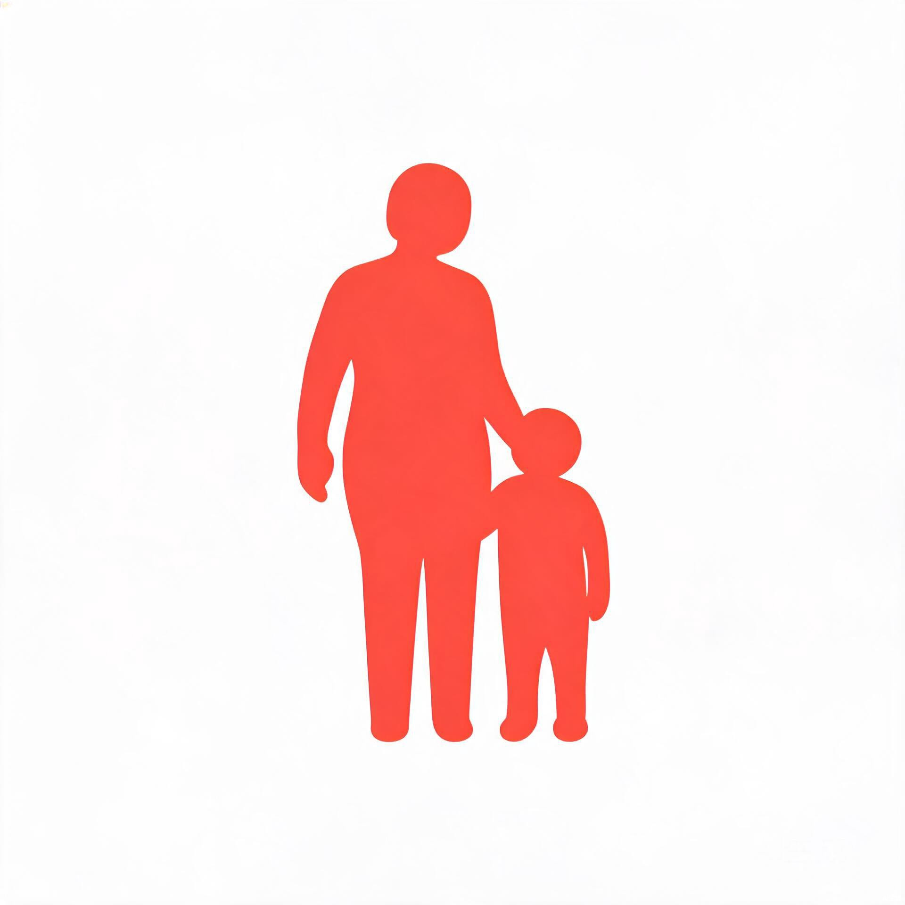

<p align="center">
  <picture>
    <source media="(prefers-color-scheme: dark)" srcset="assets/logo.jpg">
    
  </picture>
</p>

<h1 align="center">Chinese Parents Skill</h1>

<p align="center">
  <em>중국식 부모 시뮬레이터 —— 당신의 엄마는 어떤 엄마인가요?</em>
</p>

<p align="center">
  <a href="https://github.com/weed33834/chinese-parents-skill/blob/main/LICENSE">
    
  </a>
  <a href="https://github.com/weed33834/chinese-parents-skill/releases">
    
  </a>
  <a href="https://github.com/weed33834/chinese-parents-skill/stargazers">
    
  </a>
  <a href="https://github.com/weed33834/chinese-parents-skill/commits/main">
    
  </a>
  <a href="https://github.com/weed33834/chinese-parents-skill/issues">
    
  </a>
  <a href="https://github.com/weed33834/chinese-parents-skill">
    
  </a>
</p>

<p align="center">
  <a href="README.md">中文</a> · <a href="README.en.md">English</a> · <a href="README.ja.md">日本語</a> · <a href="README.ko.md">**한국어**</a>
</p>

<p align="center">
  <a href="#개요">개요</a> ·
  <a href="#세-가지-모드">세 가지 모드</a> ·
  <a href="#10개-차원">10개 차원</a> ·
  <a href="#계산기">계산기</a> ·
  <a href="#18가지-상황">상황</a> ·
  <a href="#기여">기여</a>
</p>

---

## 개요

엄마한테 "남의 집 애 좀 봐"라는 말 들어본 적 있나요?

시험에서 3등 했을 때, 먼저 칭찬하더니 "그럼 1등은 몇 점이야?"라고 묻는 엄마도 있죠?

이 프로젝트는 이론 연구가 아닙니다. 딱 세 가지 일만 합니다.

- **시뮬레이션** —— 엄마가 어떤 사람인지 알려주면, AI가 그대로 연기함
- **진단** —— 엄마의 행동을 묘사하면, 스스로 다시 계산할 수 있는 차원 프로필을 역산함
- **대응** —— 입에 올리기 겁나는 이야기, 그 대화를 먼저 한 번 리허설함

중국식 부모는 하나가 아닙니다. "시험 3등"이라는 같은 일에도, 먼저 혼내고 나서 묻는 엄마도 있고, 먼저 칭찬하고 나서 묻는 엄마도 있고, 아예 안 묻는 엄마도 있습니다. 10개 차원, 각각 0~100점, 이론상 **59,049가지 부모 형태**를 커버합니다.

**이 스킬의 목적은 한 문장으로: 당신과 남 누구나 다시 계산할 수 있는 '중국식 부모 프로필'을 복원하는 것.** 시뮬레이션·진단·대응은 모두 수단이고, 프로필이 목적입니다. 계산된 그 '엄마'는, 논리가 서야 합니다(수식이 있음), 일치해야 합니다(같은 사람 두 번 물으면 같은 결과), 그리고 정직하게 실패해야 합니다(데이터가 모자라면 '계산 불가'라 말하고, 지어내지 않음). v0.5에서 보강한 토대는 바로 이 세 가지를 위한 것입니다. 다중 턴 추론이 진짜로 돌아가고, 가짜 숫자는 막혔으며, 문서의 모든 숫자를 어설션이 지키고 있습니다.

**v0.5의 가장 큰 변화**: v0.4에는 '계산기'가 있었지만 첫 턴만 계산했습니다. "내가 받아치면 어떻게 반응하냐"고 물어도 답을 못 했죠. 이제 다중 턴 상태 머신이 완전히 구현돼 5턴 대화가 값 단위로 재현됩니다. 또한 빠진 차원을 묵묵히 50으로 채우던 것(이건 v0.4 스스로가 경고한 가짜 숫자 함정입니다)은 사라지고, known/inferred/blind 3단계 신뢰도 + 오염 추적을 거치게 됐습니다.

---

## 세 가지 모드

### 1. 시뮬레이션

프로필을 주면 연기합니다. **다중 턴** 지원 —— 받아치면 그녀가 어떻게 격화(에스컬레이션)하는지 볼 수 있습니다.

```
당신: 우리 엄마는 엄격하지만 속은 누군데, 내가 그만두고 1인 미디어 할란다 했을 때

AI： 【프로필】통제 엄격(72)·온기 따뜻(58)·불안 불안(60)·가치관 전통(30)
     【상태】TEMP 24(긴장)·BOND 69·양보 임계 70

     "1인 미디어? 그게 무슨 직업인데, 연금이랑 의료보험은 누가 내줘?"
     ...
     ── TEMP 42 ↑18(압박)│ BOND 66 ↓3 │ 설득 진도 12/70

당신: 이건 내 일인데 참견 마

AI： ── TEMP 75 ↑33(감정화)│ BOND 58 ↓8
     "네 일? 네 인생에서 내가 안 걱정한 게 뭐가 있어? 좋아, 네 일, 다 네 일이지……"
```

"이건 내 일이야"라는 말은 지뢰표에서 +40, `CTL≥75`인 부모에게는 추가로 +10이 붙습니다. **이건 어휘 전체에서 가성비 최악의 한 마디다 —— 이치는 네 편인데, 판은 진다.**

### 2. 진단

행동을 묘사하면 프로필을 역산합니다. 아니면 30문항 퀴즈.

```
  통제  █████████████████████░░░   88  지배적
  온기  ██████░░░░░░░░░░░░░░░░░░   25  이성적
  참여  █████████████████░░░░░░░   70  주체적
  불안  ████████████████████░░░░   85  패닉
  소통  ████░░░░░░░░░░░░░░░░░░░░   18  명령
  가치관  █████░░░░░░░░░░░░░░░░░░░   20  전통적
  경제  ███████░░░░░░░░░░░░░░░░░   30  구두쇠
  기대  ██████████████████████░░   92  매우 높음
  사교  █████░░░░░░░░░░░░░░░░░░░   22  폐쇄적
  독립  ████░░░░░░░░░░░░░░░░░░░░   15  대행

  ── 발동한 결합 규칙 ──
   ▸ 온기 없는 압박: 집이 관리 사무실이 되어 명령만 있고 감정 회로가 없음
   ▸ 갈 곳 없는 불안: 불안이 풀릴 곳이 없어 끊임없는 잔소리와 빈정거림이 됨
   ▸ 성적에 걸린 사랑: 망치면 사랑을 잃고, 침묵이 주된 처벌

  ── 참고 유형과의 유사도 ──
   호랑이 부모  91%   주요 차이 불안 85 vs 65, 통제 88 vs 70
   강압적 부모  91%   주요 차이 불안 85 vs 60, 경제 30 vs 45

  ── 읽는 법 ──
   처음부터 압박대에 있다. 운을 띄울 여지 없이 본론 직행.
   양보 임계 87, 한 번의 대화로 그만한 설득력은 모으지 못함.
   목표는 설득이 아니라, 관계 점수 깎지 않고 다음 라운드까지 버티는 것.
```

**이 숫자들은 장식이 아닙니다.** v0.3에도 퍼센트는 찍혔지만, 문서 전체에 알고리즘이 없었습니다 —— 같은 사람 두 번 물으면 보고서 두 개가 나왔죠. v0.4는 수식과 계산기를 제공했습니다. 직접 확인하세요.

### 3. 대응

v0.4에서 새로 추가됐고, 대다수가 진짜 원하던 부분입니다.

진단은 "엄마가 호랑이 부모다"라고 알려줍니다. 하지만 진짜 알고 싶은 건 **이 이야기를 어떻게 꺼내야 하느냐**죠.

대응 모드가 주는 것은: 목표 실현 가능성 등급(이길 수 없는 싸움도 있고, 그것을 솔직히 말함), 세 갈래 경로(정면/측면/기정사실), 12개 전술, 3층 반응 트리, 그리고 판이 깨졌을 때 수습법입니다.

> **T4 체면(miànzi) 보전**
> 중국 가정의 압력 상당수는 부모 본인이 원한 게 아닙니다. 친척이 밥상에서 뭘 물어보고 답을 못 내리면, 압력이 아래로 굴러내려 당신에게 닿죠.
> 밥상에서 할 수 있는 한 마디를 건네면, 압력의 근원을 그녀에게서 치워버리는 겁니다.
> 더 강한 건: "진짜 몰아붙이면 전화 나한테 넘겨, 내가 말할게."
> 그녀가 원하는 건 당신의 결혼이 아니라, 밥상에서 망신 안 당하는 겁니다.

*체면*(**面子** *miànzi*)은 친척 앞에서 그녀가 지니는 체통입니다. 공개석상에서 그것을 잃는 건 중국 가정에서 진짜 비용이지, 비유가 아닙니다.

---

## 10개 차원, 중국식 부모 해부

| 차원 | 무엇을 잴까 | 0단 → 100단 |
|------|------------|--------------|
| 통제 `CTL` | 관리 범위 | 방임·적당·엄격·지배적 |
| 온기 `WRM` | 감정 표현 농도 | 냉정·이성적·따뜻·과보호 |
| 참여 `INV` | 얼마나 에너지 쏟았나 | 부재·수동적·주체적·과잉개입 |
| 불안 `ANX` | 미래에 대한 불안 | 불교식·적당·불안·패닉 |
| 소통 `COM` | 정보 흐름 방향 | 명령·설교·상의·경청 |
| 가치관 `VAL` | 보수적일까 진보적일까 | 전통적·혼합·진보적 |
| 경제 `FIN` | 돈 쓰는 방식 | 구두쇠·적당·후함 |
| 기대 `EXP` | 기대 높이 | 무관심·적당·매우 높음 |
| 사교 `SOC` | 교우 관계 관리 | 폐쇄적·유도적·개방적 |
| 독립 `IND` | 키울까 대행할까 | 대행·유도·놔둠 |

**직관에 반하는 두 가지**:

`온기`는 "사랑의 양"이 아니라, **감정 표현의 농도**입니다. 0단 냉정은 사랑을 입 밖에 내지 못하는 것이고, 100단 과보호는 숨 막히게 두터운 사랑입니다. 양 극단 다 문제 —— 이건 중간 약간 위가 최적인 유일한 차원입니다.

`소통`은 "말을 많이 하는지"가 아니라, **정보 흐름의 방향**입니다. `COM=88`인 부모는 저녁 내내 문장 세 개만 할 수도 있지만, 그게 모두 "그래서 어땠어?" "어떻게 생각해?"입니다. 수다쟁이를 고득점으로 착각하지 마세요.

### 한 차원만으론 안 보이는 것

부모가 다루기 힘든지 결정하는 건 대개 조합입니다.

| 조합 | 그것이 무엇인가 |
|------|----------------|
| `소통高` + `통제高` | **민주주의 쇼**. 40분 동안 당신 말 다 듣고 나서, 원래 계획 그대로 실행 |
| `참여低` + `소통低` + `통제中` | **좀비식 육아**(zhàshī-shì, "시체가 일어남"). 몇 달은 사라졌다가, 하루아침에 깨어나 전권 장악, 예고 없음 |
| `통제高` + `온기高` | **달콤한 질식**. 소리 지르지 않고 욕하지 않고, 한숨과 눈물뿐. 싸움 들어갈 문조차 못 찾음 |
| `불안高` + `경제低` | 갈 곳 없는 불안이 잔소리와 빈정거림으로 변함 |
| `기대高` + `온기低` | 사랑이 성적에 매달림. 망치면 사랑 잃고, 침묵이 주된 처벌 |

**민주주의 쇼가 가장 알아보기 힘듭니다.** 과정이 "좋은 소통"의 기준을 모두 충족하기 때문입니다. 화낼 근거조차 못 찾아, 자기 자신을 의심하게 됩니다.

판단 기준은 딱 하나: **다 듣고 난 뒤, 결론이 움직였나?**

### 8개 앵커

부모의 "종류"가 아니라, 지도 위 8개 좌표입니다. 유사도 채점에 씁니다. 당신 엄마는 거의 확실히 그 사이 어딘가에 있습니다. 완전한 벡터는 [dimensions.md](references/dimensions.md).

| 앵커 | `--type` 값 | 한 줄로 |
|------|-------------|---------|
| 호랑이 부모 | `虎妈虎爸` | 가장 높은 기준, 가장 낮은 온기, 협상 없음 |
| 지와식 부모 | `鸡娃家长` | *jīwá*(계혈·"닭 피(鸡血) 맞은 아이" 줄임말, 네트워크 유행어)——눈 뜨는 순간부터 잠들 때까지 학원·사교육으로 꽉 찬, 돈은 아끼지 않고 내내 패닉 |
| 헬리콥터 부모 | `直升机父母` | 개입이 유용한 범위를 훨씬 넘음 |
| 불계 부모 | `佛系家长` | *fóxì*(불계·"마이웨이" 네트워크 유행어, 진짜 불교 아님)——진짜로 압박 안 함 |
| 개방적 부모 | `开明家长` | 듣고, 결론이 진짜로 움직임 |
| 강압적 부모 | `强势家长` | 대신 결정, 설명 없이, 저항하면 격화 |
| 좀비식 육아 | `诈尸式育儿` | 기본 부재, 갑자기 깨어나 전권 장악 |
| 사별식 육아 | `丧偶式育儿` | *sàng'ǒu-shì*(사별한 듯)——한 부모가 집에 있으나 실질적 부재 |

마지막 둘의 차이는 `CTL`과 `ANX`뿐. 사별식은 진짜 손을 뗐습니다(`CTL=12`). 좀비식은 몇 달 무시하다가 처음부터 다시 합니다(`CTL=30`에 `COM=12`, 순수 명령). 좀비식이 더 해롭습니다 —— 예고 없는 개입이니까요.

---

## 계산기

### 프로필

```bash
# 일부 차원만 주고, 나머지는 결합 규칙으로 추론
python3 scripts/profile.py --scores "CTL=88,ANX=85,EXP=92"

# 참고 유형 불러오기
python3 scripts/profile.py --type 虎妈虎爸

# 30문항 퀴즈 대화형 응답
python3 scripts/profile.py --quiz

# 답안 문자열은 저장 가능, 다음에 그대로 재현
python3 scripts/profile.py --answers cdcbbdcddcaabbcbabcabdddaacbad

# 기계 가독
python3 scripts/profile.py --scores "..." --json
```

순표준 라이브러리, 의존성 제로, Python 3.8+. 차원 막대그래프, 극단 차원, 결합 규칙, 유사도 순위, 6개 다이내믹스 초기값과 읽는 법을 출력합니다.

**빠진 차원은 추측하지 않음:** `CTL=90`만 주면 나머지는 결합 규칙으로 추론되거나(`inferred`, 방향은 믿을 만하나 수치는 믿지 말 것) 50으로 채워집니다(`blind`, 결론 무효). 채워진 차원이 하류 다이내믹스 값을 오염시키면 출력에 `⚠`이 붙고 **유사도와 읽는 법이 억제됩니다**. `blind` 차원이 4개 이상이면 아예 "유사도 미보고"가 됩니다. 안 하는 게 낫지, 지어내지 마세요.

**문서의 모든 숫자는 이 스크립트 재계산과 일치합니다.** 8개 참고 유형 × 6개 다이내믹스 값 표도 포함. 안 맞으면 버그이니 Issue 환영.

### 다중 턴 추론

```bash
# 지뢰표/얼음깨기표의 모든 기술 보기
python3 scripts/profile.py --list-moves

# 내장 5턴 예시 실행(dynamics.md §7.2)
python3 scripts/profile.py --simulate-demo

# 직접 기술 순서·관계 계좌 초기값·채널 지정
python3 scripts/profile.py --type 虎妈虎爸 \
    --simulate T21 T9 T1 C2 C18 --bond 69 --channel wechat --who 我
```

`--simulate`는 각 턴을 행별 대장으로 찍습니다: 어떤 대사에서, 몇 도 올랐는지·내려갔는지, BOND가 어떻게 움직였는지, 설득 진도가 어디인지. 끝에 **판정**(진짜 양보/가짜 양보/양보 안 함)과 **"가장 비싼 한 마디"** —— 이치는 네 편인데 관계 점수를 가장 많이 깎인 한 마디 —— 를 냅니다. 대면 외(전화/WeChat)는 온도 상승이 0.8배, WeChat은 또 0.8배지만, BOND 피해는 ×1.2됩니다.

**이 추론은 데모가 아닙니다.** `dynamics.md` 제4~7절의 실행 가능 명세입니다. 가산 효용은 최고 1건만 취하고(합산 안 함), 턴당 순가열 +35 상한, TEMP≥85에서는 `[고온]` 항목만 발동하며 ×1.5, 같은 얼음깨기 대사 2번째는 ×0.5, 3번째는 ×0. `--simulate-demo`의 5턴 결과는 문서 §7.2와 값 단위로 일치하며, 수식을 바꾸면 `scripts/test_profile.py`의 68개 어설션에 즉시 걸립니다.

---

## 18가지 상황

앞 10개는 옛것, 뒤 8개는 v0.4에 새로 추가. 완전 행렬은 [scenarios.md](references/scenarios.md).

| | 상황 | 핵심 차원 |
|---|------|----------|
| A | 학업/직장 성적 | 통제·불안·기대 |
| B | 인생 선택(퇴사·창업·갭년) | 가치관·통제·불안 |
| C | 연애·결혼 | 가치관·사교·통제 |
| D | 소비/경제 | 경제·통제 |
| E | 집에서 동거 | 온기·참여 |
| F | 친구·사교 생활 | 사교·통제 |
| G | 인터넷/전자기기 | 통제·불안 |
| H | 건강/생활 습관 | 온기·참여 |
| I | 외모/이미지 | 가치관·통제 |
| J | 학교 선택·학원 | 불안·경제·기대 |
| **K** | **친척 모임과 가로 비교** | 불안·사교·기대 |
| **L** | **결혼·출산·혼수(폐금) 압박** | 가치관·불안·통제 |
| **M** | **주택 구매와 가족 자금** | 경제·통제·독립 |
| **N** | **노부모 부양** | 온기·참여·경제 |
| **O** | **다자녀와 편애** | 온기·경제·기대 |
| **P** | **감정과 정신건강** | 가치관·온기·소통 |
| **Q** | **프라이버시 경계(휴대폰 뒤짐)** | 통제·사교 |
| **R** | **친척이 이름도 못 짓는 비주류 직업** | 가치관·불안·기대 |

*폐금*(**彩礼** *cǎilǐ*)은 결혼 전 신랑 측이 신부 측 가족에게 넘기는 금품입니다. 중국 광범위 지역에서 여전히 산 현안 교섭이고, 두 가족이 진짜 싸우는 건 보통 이것입니다.

새 상황 중 **M(주택 구매)**에서 싸우는 건 결코 돈 그 자체가 아니라, "그 돈을 받고 난 뒤 당신에게 발언권이 얼마나 남느냐"입니다. **O(편애)**에서 가장 무거운 건, 동생에게 간 10만 위안이 아니라, 당신에 대해 들은 "얘는 이제 기대하지 마" 한 마디입니다.

---

## 디렉터리 구성

```
chinese-parents-skill/
├── SKILL.md                    # 메인 진입점, 모드 라우팅과 로드 내비
├── references/
│   ├── dimensions.md           # 10차원 수치 코어(유일한 정보원)
│   ├── scenarios.md            # 18상황 × 차원 영향 행렬
│   ├── dynamics.md             # 감정 상태 머신, 지뢰/얼음깨기표, 양보 판정
│   ├── diagnosis.md            # 진단 흐름, 감별 진단, 보고서 형식
│   ├── counterplay.md          # 대응 모드: 경로, 12전술, 반응 트리
│   ├── family-system.md        # 다역할 가족 시스템, 배경 수정 인자
│   ├── quotes.md               # 인용 라이브러리, 속마음 번역표
│   ├── quirks.md               # 괴행·상식 밖 부모 케이스집: 17개 기이한 사고 패턴 템플릿＋상황 사례＋반논리 시뮬레이션 규율
│   └── quiz.md                 # 30문항 퀴즈 문제집(스크립트 자동 출력)
├── scripts/
│   └── profile.py              # 프로필 계산기, 순표준 라이브러리
├── README.md · README.en.md · README.ja.md · README.ko.md · CHANGELOG.md
├── CONTRIBUTING.md · CODE_OF_CONDUCT.md · LICENSE
└── assets/ · .github/
```

SKILL.md는 v0.3의 627행 단일 파일에서 메인 진입점 + 온디맨드 로드로 쪼갰습니다. **예쁘게 하려는 게 아닙니다. 26KB 단일 파일이 매번 전문으로 컨텍스트에 들어갔으니까요.**

---

## 경계

이 스킬은 부모 자식 상담도, 가족 치료도 안 하고, 어느 쪽 편도 들지 않습니다. 또한 다음도 하지 않습니다.

- 신체 폭력, 학대, 신체 자유 제한 시뮬레이션
- 지역 고정관념, 혹은 고향·학력·직업에 따른 차별적 귀인
- "인격장애""정서적 학대" 같은 라벨을 사람에게 붙임 —— 행동 패턴을 묘사할 뿐, 임상 판단은 내리지 않음
- 시뮬레이션 끝에 "속보면 부모는 다 당신을 사랑해"를 억지로 덧붙임

**당신 상황이 신체 안전, 심각한 정서적 학대, 경제적 강요, 혹은 자해 생각을 포함한다면, 여기서 대본 찾지 마세요.** 그건 표현을 바꾼다고 해결되는 문제가 아닙니다. 현실에서 진짜 도와줄 사람을 찾으세요.

---

## 기여

엄마가 여기에 안 담긴 독특한 한 마디가 있나요? 어떤 상황이 엄마답지 않나요? 어떤 차원의 점수 구간이 어긋났나요?

참지 마세요. 이 프로젝트는 다함께 만듭니다. 당신 엄마의 경험은 대개 남의 엄마에게도 해당할 겁니다.

- 문제 발견 → [Issue 만들기](https://github.com/weed33834/chinese-parents-skill/issues/new?template=bug_report.md)
- 아이디어 → [기능 제안](https://github.com/weed33834/chinese-parents-skill/issues/new?template=feature_request.md)
- 새 상황 → [상황 제안](https://github.com/weed33834/chinese-parents-skill/issues/new?template=scenario_suggestion.md)

PR 보내기 전에 [CONTRIBUTING.md](CONTRIBUTING.md)를 보세요. 수식이나 차원 벡터를 바꾼 분은 `scripts/profile.py`를 돌려 문서 숫자가 아직 맞는지 확인해 주세요.

## 라이선스

[Apache-2.0](LICENSE) © 2026 badhope
